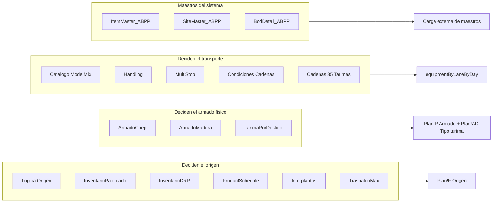

[Volver a la macro de entrada](README.md) · [Índice general](../README.md)

# Maestros y catálogos

Además del `Plan`, la macro de entrada consulta una veintena de hojas de maestros. Este
documento describe cada una: qué contiene, quién la mantiene y qué pasa si le falta una fila.

## Panorama

Las hojas se agrupan en cuatro familias según su función:

## `Handling`

La hoja de cupos por destino. Define, para cada destinatario, cuántas tarimas caben en cada
combinación de modo y carrocería, y desde qué plantas se puede surtir.

Encabezados reales (de [data/handling.tsv](../../data/handling.tsv)):

| Col | Encabezado | Rol |
|---|---|---|
| `A` | `destinatario` | Llave. ID numérico o `FG14_<slug>` |
| `B` | `CADENA` | Cadena comercial |
| `C` | `Cadena 2` | Variante del nombre |
| `D` | `CADENA AGRUPADORA` | Agrupación comercial (`Autoservicios Varios`, `Mayoristas`, …) |
| `E` | `Destino` | Ciudad o plaza |
| `F` | `CPFR` | Responsable comercial |
| `G` | `Handling` | Cupo máximo. `EqByLane` lo calcula como `MAX(L:O)` mediante fórmula (`merged/modulo1.vba:1272-1274`) |
| `H` `I` `J` `K` | `Sencillo - Caja Seca`, `Sencillo - Encortinado`, `Full - Caja Seca`, `Full - Encortinado` | Banderas `SI`/`NO`: qué combinaciones están permitidas |
| `L` `M` `N` `O` | Las mismas cuatro, con cupo numérico | **Cupos base.** Es la configuración de referencia |
| `P` `Q` `R` `S` | Las mismas cuatro, con cupo numérico | **Cupos activos.** Es lo que realmente usa `EqByLane` |
| `T` | `Hay Fulles?` | Bandera derivada |
| `U` a `AC` | `PC01` `PC03` `PC05` `PC07` `PC11` `PC13` `PC19` `PC29` `PC23` | Banderas de planta habilitada, en ese orden exacto |

### La distinción entre cupos base y cupos activos

`L:O` son los cupos base y `P:S` los activos. Los botones `Handling*` manipulan solo los
activos:

- `HandlingNormal` copia `L:O` sobre `P:S`, restaurando la base.
- Las variantes `HandlingNOFULL`, `HandlingNOSENCILLO`, `HandlingNOFULLAUTO` y
  `HandlingNOSENCILLOAUTO` ponen en cero el par correspondiente de `P:S`.

Así se puede desactivar temporalmente un modo de transporte sin perder la configuración
original. Ver el detalle en [01-runbook-operador.md](01-runbook-operador.md#paso-3--ajustes-de-handling-opcional).

### Banderas de planta

El mapeo planta → columna está codificado en `LBS_HandlingPCFlagCol`
(`merged/modulo4.vba:342-355`):

| Planta | Columna | Planta | Columna |
|---|---|---|---|
| `PC01` | `U` | `PC13` | `Z` |
| `PC03` | `V` | `PC19` | `AA` |
| `PC05` | `W` | `PC29` | `AB` |
| `PC07` | `X` | `PC23` | `AC` |
| `PC11` | `Y` | | |

Cualquier otra clave devuelve cadena vacía, es decir, esa planta no tiene columna en
`Handling` y no puede habilitarse desde aquí. El orden no es alfabético ni numérico:
`PC23` va después de `PC29`. Es un detalle fácil de romper al insertar columnas.

`LBS_Cat_ClearHandlingOriginFlags` (`merged/modulo4.vba:357-367`) limpia las nueve de golpe
antes de reaplicar el catálogo.

## `Catalogo Mode Mix`

El catálogo que decide, por carril, si se programa `Sencillo` o `Full` y con qué equipo.
Es la fuente de verdad del transporte y lo consultan **las dos macros**.

Encabezados (de [merged/catmodemixmacro.tsv](../../merged/catmodemixmacro.tsv)):

| Col | Encabezado | Rol |
|---|---|---|
| `A` | `Key` | Llave concatenada |
| `B` | `ID Origen Moderno` | ID numérico del origen. **Parte de la llave del carril** |
| `C` | `Origen Moderno` | Nombre corto del origen (`CMM`, …) |
| `D` | `Destinatario` | ID del destino. **Parte de la llave del carril** |
| `E` | `Cadena` | Cadena comercial |
| `F` | `Destino` | Nombre de la plaza |
| `G` | `KM Moderno` | Distancia |
| `H` | `Mode Mix` | `S` (Sencillo) o `F` (Full) |
| `I` | `Tipo Equipo` | Por ejemplo `Sencillo 53"` |
| `J` | `Especializado` | `Caja Seca` o encortinado |
| `K` | `Pallets Max` | Cupo de tarimas del carril |
| `L` | `Peso Max` | Techo de peso, por ejemplo `28.9 T` |

La llave de búsqueda es `ID Origen Moderno` + `Destinatario`
(`merged/modulo4.vba:465-476`). Como el Plan trae la planta en formato `PC29` y no como ID
numérico, hace falta la traducción de la hoja `OrigenModernoMap`
(`LBS_ResolvePCFromOrigenId` y `LBS_ResolveOrigenIdFromPC`, `merged/modulo4.vba:377`,
`merged/modulo4.vba:394`).

### Funciones de consulta

Cada atributo del catálogo tiene su par de funciones: una que construye un diccionario para
consultas masivas y otra para consultas puntuales.

| Atributo | Constructor del diccionario | Consulta puntual |
|---|---|---|
| Mode Mix | `LBS_BuildCatalogModeMixDict` | `LBS_LookupCatalogModeMix` |
| Especializado | `LBS_BuildCatalogEspecializadoDict` | `LBS_LookupCatalogEspecializado` |
| Pallets Max | `LBS_BuildCatalogPalletsMaxDict` | `LBS_LookupCatalogPalletsMax` |

Todas están en el módulo 4, alrededor de `merged/modulo4.vba:400-500`. La versión con
diccionario es la que se usa en los recorridos largos; la puntual sirve para validaciones.

### Validación e integración

`LBS_ValidarCatalogoModeMix` (`merged/modulo4.vba:667`) revisa la coherencia entre el modo y
el tipo de equipo mediante `LBS_Cat_ModeTipoCoherent`. Si falla, `ValidarDestinos` se detiene
con el mensaje "Catalogo Mode Mix invalido" y **no** aplica nada
(`merged/modulo2.vba:1093-1096`).

`LBS_AplicarCatalogoAHandling` (`merged/modulo4.vba:926`) es la que vuelca el catálogo sobre
`Handling`: por cada destino, ajusta los cupos y las banderas de planta según los carriles
que existan en el catálogo. Esta es la razón por la que hay que correr `ValidarDestinos`
**antes** de los ajustes manuales de `Handling` y no después.

`LBS_AplicarCatalogoConnectionOrigins` (`merged/modulo4.vba:994`) hace lo propio con los
orígenes de las conexiones.

## `TarimaPorDestino`

Define el tipo de tarima y la clasificación de cliente por destino.

| Col | Rol | Cita |
|---|---|---|
| `A` | Cadena | `merged/modulo5.vba:192` |
| `B` | CEDIS | `merged/modulo5.vba:193` |
| `C` | Destino (llave de búsqueda) | `merged/modulo2.vba:1121` |
| `D` | Tipo de tarima | `merged/modulo5.vba:195` |
| `E` | Tipo de cliente (`Mayorista` / `Autoservicio`) | `merged/modulo3.vba:126` |

La columna `E` alimenta `Plan!A` a través de `CO_FillPlanTipoCliente`
(`merged/modulo3.vba:115-135`), y esa clasificación es la que separan los botones
`HandlingNOFULL` (Mayorista) de `HandlingNOFULLAUTO` (Autoservicio).

Si falta la fila del destino, `Plan!A` queda con `No informado` y el destino aparece en la
fila 17 de `User Guide`.

## `ArmadoChep` y `ArmadoMadera`

Las dos hojas que definen cuántas cajas caben en una tarima. La separación existe porque el
armado depende físicamente del tipo de tarima.

`ArmadoChep`:

| Col | Rol | Cita |
|---|---|---|
| `A` | Cadena | `merged/modulo1.vba:420-421` |
| `B` | Tipo de tarima | — |
| `C` | Material / SKU | `merged/modulo1.vba:421` |
| `D` | Armado (cajas por tarima) | — |
| `E` | `LBS Item Id` | `merged/modulo1.vba:1083` |

La columna `E` es clave y suele pasar desapercibida: es el `Item Id` **exacto** que espera
LBS para esa combinación cadena + SKU. Cuando existe, se usa tal cual. Cuando falta, la macro
lo construye concatenando el SKU con el sufijo de la cadena
(`LBS_CadenaItemSuffix`, `merged/modulo1.vba:963-985`), y ahí es donde aparecen los errores de
`Left(cadena,3)` que reporta `ValidarExportMEXKA`. Ver
[cadenas/README.md](cadenas/README.md).

`ArmadoMadera` tiene la misma estructura para tarima de madera. Un item que existe en madera
pero no en CHEP (o al revés) produce hallazgos en las filas 16 y 18 de `User Guide`.

Ambas hojas las actualiza `SincronizarCatalogoHomologado` desde el catálogo TI HI. Ver
[08-catalogo-homologado-tihi.md](08-catalogo-homologado-tihi.md).

## `Logica Origen`

Define, para cada combinación destino + item, qué plantas pueden surtirlo y en qué orden de
prioridad. Es el primer insumo de `CambioOrigen`.

Las plantas resueltas se escriben en `Plan!AB` (primaria) y `Plan!AC` (secundaria)
(`merged/modulo2.vba:1174-1175`). Un destino sin fila aquí aparece en la fila 13 de
`User Guide` y su renglón termina como `FABRICA`.

## Inventarios y producción

Los cuatro insumos que `CambioOrigen` consume para decidir el origen:

| Hoja | Columna de cantidad | Qué representa |
|---|---|---|
| `InventarioPaleteado` | `N` | Inventario físico ya paletizado, por planta e item |
| `InventarioDRP` | `R` | Inventario proyectado del DRP |
| `ProductSchedule` | — | Programa de producción, para pedidos que se cubren con producto por producir |
| `TraspaleoMax` | — | Límite de traspaleo por planta |
| `Interplantas` | — | Movimientos entre plantas permitidos |

Las columnas `N` y `R` **deben ser numéricas**. `CO_ValidateInventarioNumeric`
(`merged/modulo3.vba:62`) lo verifica y aborta con
`"Los valores de inventario son incorrectos. Revise InventarioPaleteado (col N) e InventarioDRP (col R)."`
(`merged/modulo3.vba:883`). En modo prueba esta validación se omite.

## `SKU Homologo`

Tabla de sustitución de SKU. Cuando un material del Plan no tiene inventario pero su
homólogo sí, `CO_ApplySkuHomologo` (`merged/modulo3.vba:608`) hace el cambio.
El procedimiento `SKUhomologo` (`merged/modulo3.vba:1134`) es el auxiliar que ejecuta la
sustitución fila por fila.

## `IDPlantas` y `OrigenModernoMap`

Las dos tablas de traducción de identificadores de planta:

- `IDPlantas` convierte entre el código `PCnn` y el ID interno del sistema.
- `OrigenModernoMap` convierte entre `PCnn` y el `ID Origen Moderno` del catálogo Mode Mix
  (`LBS_OrigenModernoMapSheetName`, `merged/modulo4.vba:165`).

Sin estas traducciones, la búsqueda en el catálogo falla y todos los carriles aparecen como
"sin catálogo Mode Mix" en la fila 20 de `User Guide`.

## `FG14 Destinos`

El registro de los destinos que no tienen ID numérico de CEDIS y se identifican por cadena.
Su llave tiene la forma `FG14_<slug de cadena>`.

Encabezados (de [data/fg14_destinations.tsv](../../data/fg14_destinations.tsv)):
`destinatario_key`, `cadena`, `cedis_slug`, `tipo_tarima`, `pallets_max`, `clasificacion`,
`mode_mix`, `item_suffix`.

`LBS_AplicarFg14DestinosAMaestros` (`merged/modulo4.vba:1085`) siembra desde aquí las filas
que falten en `Handling` y `TarimaPorDestino`, de modo que estos destinos no requieran
mantenimiento manual en cada hoja.

Aplica a los clientes de comercio electrónico y mayoristas pequeños: Amazon, Rabbit,
Mercado Libre, Rapiturbo. Ver [cadenas/otras-cadenas.md](cadenas/otras-cadenas.md).

## `Inseparable`

Reglas de agrupación por cadena: qué pedidos no pueden separarse en embarques distintos.
Se carga con `VD_PrimeInseparableRules` (`merged/modulo2.vba:102`) y se consulta al construir
el `Group Id` del STR. Un destino con regla de inseparabilidad que no se pueda cumplir aparece
en la fila 19 de `User Guide`.

## `MultiStop`

Declara los destinos que se atienden en una misma ruta con varias paradas. `EqByLane` y las
validaciones lo usan para resolver alias de destino: un carril puede llegar a un destino
distinto del que dice su nombre porque va en multi-stop
(`LBS_ValExp_BuildMultiStopAliasMap`, `merged/modulo6.vba:293`).

## `Condiciones Cadenas`

Reglas por cadena que `itemConnections` aplica al construir las filas de item
(`merged/modulo1.vba:1736+`). Es donde se registran las particularidades de nivel de tarima
y capa por cadena.

## `Cadenas 35 Tarimas`

Lista blanca de cadena + SKU autorizados a cargar 35 tarimas por embarque. La macro de
entrada la lee al construir el STR; la macro de salida la usa como regla de cupo. El detalle
de la regla está en
[../tms_fg14/cadenas/mayoristas-cap35.md](../tms_fg14/cadenas/mayoristas-cap35.md).

## Hojas `*_ABPP`

Las tres plantillas de maestros para carga al sistema externo:

| Hoja | La construye | Se exporta con |
|---|---|---|
| `ItemMaster_ABPP` | `CreateItem` (`merged/modulo5.vba:59`) | `CreaTemplateItemMaster` (`merged/modulo5.vba:148`) |
| `SiteMaster_ABPP` | `CreateLocation` (`merged/modulo5.vba:166`) | `CreaTemplateSiteMaster` (`merged/modulo5.vba:326`) |
| `BodDetail_ABPP` | `CreateLocation` | `CreaTemplateBodDetail` (`merged/modulo5.vba:297`) |

También existe `ItemPackDetail_ABPP`, que `CreateItem` llena con el detalle de empaque.

Estas hojas **no** alimentan al MEX KA. Son plantillas para la carga de maestros al sistema,
y se exportan como archivos `.xls` con marca de tiempo junto al libro. Para completar
maestros faltantes **dentro** del MEX KA está la sincronización del módulo 7
(ver [07-sincronizacion-maestros.md](07-sincronizacion-maestros.md)).

`LBS_ItemMasterAppend` (`merged/modulo5.vba:36`) es el auxiliar que agrega un item a
`ItemMaster_ABPP` si no existe, y lo llama tanto `CreateItem` como el sincronizador.

## Hojas internas de construcción del export

Estas tres hojas son de trabajo: `GeneraTemplates` las muestra al empezar, las llena y las
vuelve a ocultar. Su contenido se copia al MEX KA.

| Hoja | La construye | Se copia a la hoja del MEX KA |
|---|---|---|
| `stockTransportRequests` | `dp` (`merged/modulo1.vba:69`) | `stockTransportRequests` |
| `EquipmentByLaneByDay` | `EqByLane` (`merged/modulo1.vba:1179`) | `equipmentByLaneByDay` |
| `itemConnections` | `itemConnections` (`merged/modulo1.vba:1736`) | `itemConnections` |

Detalle de cada una en [05-generacion-mexka.md](05-generacion-mexka.md).

## `User Guide`: el tablero de hallazgos

La hoja `User Guide` cumple dos funciones distintas: es donde el operador **captura**
maestros nuevos y es donde `ValidarDestinos` **reporta** lo que no pudo resolver.

### Filas de captura

| Fila | Qué se captura | La consume |
|---|---|---|
| 14 | Items nuevos | `CreateItem` |
| 15 | Destinos nuevos | `CreateLocation` |
| 18 | Items para armado | `CreateItem` |

### Filas de hallazgos

`ValidarDestinos` escribe los hallazgos a partir de la columna `G` de cada fila, y luego
`LBS_CompactUserGuideRow` los compacta eliminando huecos
(`merged/modulo2.vba:1310-1315`). `ValidarExportMEXKA` lee estas mismas filas y convierte
cada una en un hallazgo de su reporte.

| Fila | Hallazgo | Cómo se resuelve |
|---|---|---|
| 13 | Destinos o items sin `Logica Origen` | Agregar la fila en `Logica Origen` |
| 15 | Destinos sin `Handling` | Agregar la fila en `Handling`, o correr `Sync_Step1_PlanDestinosSetup` |
| 16 | Items que no están en LBS ni en `ArmadoMadera` | Agregar en `ArmadoMadera`, o correr `Sync_Step2_PlanItemsSetup` |
| 17 | Destinos que no están en LBS ni tienen tarima | Agregar en `TarimaPorDestino` |
| 18 | Pedidos con destino CHEP sin armado | Agregar la fila en `ArmadoChep`, o correr `SincronizarCatalogoHomologado` |
| 19 | Destino con cadena inseparable | Revisar la regla en `Inseparable` |
| 20 | Carriles del Plan sin catálogo Mode Mix | Agregar el carril al `Catalogo Mode Mix` |
| 21 | Orígenes de planta inválidos para cadenas de solo sencillo | La escribe `LBS_ValidarPlantOrigenCadenas` (`merged/modulo4.vba:1216`). Ver [cadenas/soriana-city-club.md](cadenas/soriana-city-club.md) |

## Hojas del archivo MEX KA

Para no confundirlas con las del libro anfitrión: estas viven en
`MEX KA PLANTS_Restos_v*.xlsx` y la macro las escribe desde fuera.

| Hoja del MEX KA | Qué contiene |
|---|---|
| `stockTransportRequests` | Los pedidos a optimizar |
| `equipmentByLaneByDay` | Equipo disponible por carril y por día |
| `itemConnections` | Atributos de item por carril |
| `connections` | Los carriles origen-destino válidos |
| `items` | Maestro de items |
| `itemPackage` | Dimensiones y peso de empaque |
| `plans` | Parámetros del horizonte de planeación |
| `facilities` | Maestro de instalaciones |
| `stpGroupExclusions` | Exclusiones de agrupación |
