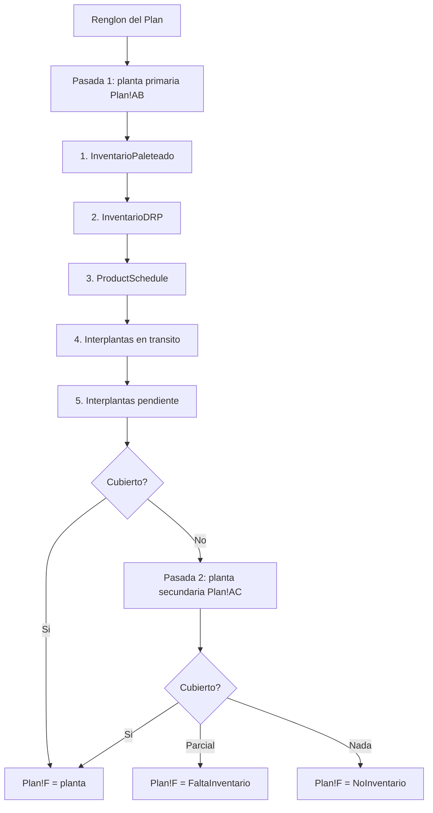

[Volver a la macro de entrada](README.md) · [Índice general](../README.md)

# `CambioOrigen` — asignación de planta

`merged/modulo3.vba:830`

`CambioOrigen` responde una sola pregunta por cada renglón del Plan: **desde qué planta se
surte esto**. La respuesta se escribe en `Plan!F`. Si ninguna planta puede cubrirlo, escribe
una de las tres marcas de fallo y ese renglón queda fuera del export.

El nombre del módulo en el código es `CO_*`. Todas las funciones auxiliares llevan ese
prefijo.

## Idea general

Cada renglón del Plan trae dos plantas candidatas, resueltas previamente contra la hoja
`Logica Origen` y guardadas en `Plan!AB` (primaria) y `Plan!AC` (secundaria). La macro
intenta cubrir la cantidad pedida con la planta primaria; lo que no alcance se intenta con la
secundaria en una segunda pasada.

Dentro de cada planta, las fuentes de suministro se consumen en un orden fijo de prioridad,
y cada fuente descuenta lo que entrega para que el siguiente renglón no la use dos veces.



## Preparación

Antes de recorrer el Plan, la macro hace una secuencia fija de preparación
(`merged/modulo3.vba:844-941`):

1. **Apaga cálculo, eventos y alertas** para no arrastrar recálculos en cada celda escrita.
2. **Quita el autofiltro de las nueve hojas** que va a leer: `Plan`, `Logica Origen`,
   `InventarioPaleteado`, `InventarioDRP`, `ProductSchedule`, `TarimaPorDestino`,
   `TraspaleoMax`, `ArmadoChep`, `ArmadoMadera`, `Interplantas`, `SKU Homologo`
   (`merged/modulo3.vba:855-865`).
3. **Valida el cartonaje del Plan.** Si `Plan!M` trae fechas en lugar de cantidades, aborta
   (`merged/modulo3.vba:867-874`). Ver
   [02-plan-y-parametros.md](02-plan-y-parametros.md#la-validación-de-cartonaje-corrupto).
4. **Valida que los inventarios sean numéricos**, salvo en modo prueba
   (`merged/modulo3.vba:879-887`).
5. **Cuenta las filas** de cada hoja insumo y valida que ninguna esté vacía con
   `CO_ValidateRequiredSheets` (`merged/modulo3.vba:906-909`).
6. **Lee el margen de días previgencia** de `Plan!L1`, con 2 por omisión
   (`merged/modulo3.vba:911-914`).
7. **Resetea las columnas `E:F` de `TraspaleoMax`** a cero, porque son los contadores de
   pallets usados y traspaleados de la corrida (`merged/modulo3.vba:916`).
8. **Convierte los IDs de planta del `ProductSchedule`** y calcula sus totales
   (`CO_ConvertPSPlantIds`, `CO_ComputePSTotals`, `merged/modulo3.vba:920-921`).
9. **Llena `Plan!A` con el tipo de cliente** desde `TarimaPorDestino!E`
   (`merged/modulo3.vba:923`).
10. **Ordena el Plan por `Plan!A` descendente** (`merged/modulo3.vba:935-938`). El comentario
    del código explica por qué: *"Ordenamos por mayorista/autoservicio para que primero monte
    mayorista"* (`merged/modulo3.vba:926`). Como el inventario se consume conforme se asigna,
    el orden decide quién se queda con el producto escaso. Mayorista tiene prioridad.
11. **Construye las cachés** de inventarios y armados con `CO_BuildCaches`
    (`merged/modulo3.vba:941`). Todas las lecturas posteriores van contra arrays en memoria,
    no contra celdas.

## Pasada 1: planta primaria

Recorre el Plan **de abajo hacia arriba**, de `nFilas` a 3 (`merged/modulo3.vba:945`).
Por cada renglón:

### Normalización previa

- **Sustituye el SKU por su homólogo** si aplica, con `CO_ApplySkuHomologo`
  (`merged/modulo3.vba:949`).
- **Normaliza la vigencia** a fecha con formato `DD/MM/YYYY` (`merged/modulo3.vba:958-959`).
- **Calcula la ventana de fechas de producción**: `vigencia - diasprevigencia`, y de ahí el
  índice de última columna útil del `ProductSchedule`, topado en 38
  (`merged/modulo3.vba:960-963`).
- **Reinicia los campos auxiliares**: `Plan!F` a `FABRICA`, `Plan!AF` a 0 y las columnas
  `Q`, `R`, `S` a vacío (`merged/modulo3.vba:966-970`). Es decir, todo renglón empieza como
  `FABRICA` y solo deja de serlo si alguna fuente lo cubre.
- **Resuelve el tipo de tarima** con `CO_ResolveTipotarima` a partir del destino y la cadena,
  y lo corrige en `Plan!AD` si difiere (`merged/modulo3.vba:972-976`).
- **Fija la fecha de carga** en `Plan!D` según el tipo de cliente
  (`merged/modulo3.vba:980-997`):

  | Tipo de cliente en `Plan!A` | Fecha de carga |
  |---|---|
  | `MAYORISTA` | Hoy + 2 días |
  | `AUTOSERVICIO` | Hoy + 4 días |
  | Cualquier otro | Hoy + 2 días |

- **Actualiza el armado** en `Plan!P` con `CO_LookupArmado`, que busca por cadena + item +
  tipo de tarima (`merged/modulo3.vba:999-1002`). Solo lo sobrescribe si encontró un valor;
  si el catálogo no tiene la combinación, conserva lo que traía el Plan.

### Asignación

Con `stillNeed` inicializado a la cantidad pedida, llama en orden a
(`merged/modulo3.vba:1004-1007`):

1. `CO_AllocatePaleteadoDRPPS` — inventario paleteado, DRP y programa de producción.
2. `CO_AllocateInterplantas` — movimientos entre plantas.
3. `CO_FinalizePlanRow` — decide el valor final de `Plan!F`.

## Las fuentes de suministro en detalle

### 1. `InventarioPaleteado`

`merged/modulo3.vba:665-687`

Busca por planta + item + **tipo de tarima**. Es la única fuente que discrimina por tipo de
tarima, porque el inventario paleteado ya está físicamente armado sobre un tipo concreto.

- Si el inventario alcanza para todo, toma lo necesario, escribe la planta en `Plan!F`,
  acumula en `Plan!AF` y descuenta del inventario.
- Si alcanza para parte, toma todo lo disponible, deja el inventario en cero y sigue con
  `stillNeed` reducido.
- Si **no hay fila** para esa combinación y `Plan!AF` sigue en cero, marca `NoInventario`
  de inmediato (`merged/modulo3.vba:685-687`). Esta marca es provisional: las fuentes
  siguientes pueden reemplazarla.

Lo que entrega se registra como etiqueta en `Plan!Q` con el tipo de tarima
(`CO_AppendColTag`, `merged/modulo3.vba:629`).

### 2. `InventarioDRP`

`merged/modulo3.vba:691-713`

Busca por planta + item, sin tipo de tarima. Lo que entrega se etiqueta en `Plan!R` con el
literal `Tarima Plástica` (`merged/modulo3.vba:698`, `706`): el producto del DRP se asume
sobre tarima plástica.

Solo consume la fila si la columna `R` del inventario es numérica
(`merged/modulo3.vba:693`).

### 3. `ProductSchedule`

`merged/modulo3.vba:717-746`

Es la fuente más compleja porque el programa de producción está desplegado por columnas, una
por día. La macro recorre las columnas desde `diaPSmin` hasta `ultimafecha`, que es la
ventana entre hoy y la vigencia menos el margen.

Primero verifica que el total del renglón (columna `ultimacolumnaPS`) alcance para lo que
falta (`merged/modulo3.vba:719`). Si no alcanza y `Plan!AF` está en cero, marca
`NoInventario` (`merged/modulo3.vba:743-745`).

Cuando toma producción de un día, hace algo distinto de las otras fuentes:
**mueve la fecha de carga**. Escribe en `Plan!D` la fecha de ese día de producción más 2
(`merged/modulo3.vba:729-730`). Es lógico —no se puede cargar antes de producir— pero
significa que un renglón cubierto con producción futura sale al export con una fecha de carga
distinta de la que le tocaría por tipo de cliente.

El registro queda en `Plan!S` con el formato `<cantidad>_<fecha>--`, concatenado si toma de
varios días (`merged/modulo3.vba:726`, `735`).

### 4 y 5. `Interplantas`

`merged/modulo3.vba:749-803`

La hoja `Interplantas` tiene dos bloques independientes de columnas:

| Bloque | Columnas | Etiqueta que escribe en `Plan!S` |
|---|---|---|
| En tránsito | `F` planta, `G` item, `I` cantidad | `InterplantasTransito` |
| Pendiente | `A` planta, `B` item, `D` cantidad | `InterplantasPendiente` |

Se consumen en ese orden: primero lo que ya viene en camino, después lo que está pendiente de
embarcar. Ambos descuentan sobre la hoja, así que un segundo renglón que necesite el mismo
item ya no lo encuentra.

## `CO_FinalizePlanRow`: la decisión final

`merged/modulo3.vba:805-828`

Cierra el renglón en tres pasos.

**Primero sincroniza el cartonaje.** `CO_SyncCartonajeColumns` alinea las columnas de
cantidad con la cantidad original.

**Después recalcula tarimas y restos** a partir del armado (`merged/modulo3.vba:811-817`):

```
Plan!N = Int(cantidad / armado)                                    ' tarimas completas
Plan!O = (cantidad / armado - Int(cantidad / armado)) * armado      ' restos
```

Este es el punto donde el Plan queda consistente entre cartonaje, armado, tarimas y restos.
Si después alguien cambia el armado a mano sin volver a correr `CambioOrigen`, las columnas
`N` y `O` quedan mintiendo, y ese desajuste se propaga hasta el conteo de camiones de la
macro de salida.

Si la cantidad es cero, en lugar de recalcular limpia la presentación con
`CO_ClearZeroPlanQtyDisplay` (`merged/modulo3.vba:809-810`).

**Al final decide `Plan!F`** comparando lo acumulado en `Plan!AF` contra lo pedido
(`merged/modulo3.vba:819-828`):

| Condición | Valor de `Plan!F` |
|---|---|
| `AF >= cantidad` | La planta (asignación completa) |
| `0 < AF < cantidad` | `FaltaInventario` |
| `AF = 0` y venía como `FABRICA` o vacío | `NoInventario` |

## Pasada 2: planta secundaria

`merged/modulo3.vba:1022-1076`

Recorre el Plan otra vez, también de abajo hacia arriba, pero **solo los renglones que
quedaron en `NoInventario` o `FaltaInventario`** (`merged/modulo3.vba:1024`).

Repite la misma normalización y llama a las mismas funciones de asignación, ahora con
`origen2` de `Plan!AC`. La diferencia clave es que `stillNeed` arranca en
`cantidad - Plan!AF` (`merged/modulo3.vba:1068`): respeta lo que ya cubrió la planta
primaria, de modo que un renglón puede terminar surtido parcialmente desde dos plantas.

Si la planta secundaria está vacía, no intenta nada y va directo a
`CO_FinalizePlanRow` (`merged/modulo3.vba:1069-1073`).

## Cierre

`merged/modulo3.vba:1095-1116`

1. `CO_SyncAllCartonajeFromM` sincroniza `Plan!AA` (`Total + BACK ORDER`) desde `Plan!M`
   para todo el Plan (`merged/modulo3.vba:1097`). Esta es la columna que LBS lee como
   `Quantity`.
2. `CO_FlushCaches` escribe de vuelta a las hojas los inventarios ya descontados
   (`merged/modulo3.vba:1100`). **Hasta este momento los descuentos vivían solo en memoria.**
   Si la macro se interrumpe antes de este punto, los inventarios quedan sin descontar y hay
   que volver a correr desde cero.
3. Oculta `Logica Origen` y `SKU Homologo`, activa `Plan` y restaura cálculo, eventos y
   pantalla.

## Las tres marcas de fallo

| Marca | Significado | Cómo diagnosticarla |
|---|---|---|
| `FABRICA` | Ninguna fuente entregó nada y el renglón conservó el valor inicial. En la práctica indica que `Plan!AB` y `Plan!AC` venían vacías, es decir, que `Logica Origen` no tiene ese destino + item | Revisar `Logica Origen`. El destino aparecerá en la fila 13 de `User Guide` |
| `NoInventario` | Hay planta candidata, pero ninguna fuente tenía producto | Revisar que los inventarios estén cargados y que el item coincida. Verificar el `SKU Homologo` |
| `FaltaInventario` | Se cubrió parte del pedido pero no todo. `Plan!AF` tiene el monto cubierto | Es el caso más común y muchas veces es legítimo: simplemente no hay producto suficiente |

Ninguna de las tres es exportable: `LBS_PlanRowExportable`
(`merged/modulo1.vba:863`) las excluye, y `ValidarExportMEXKA` las reporta una por una con
un rollup al final (`merged/modulo6.vba:3470-3476`).

## Efecto del modo prueba

Con `Plan!V1` activo, `CO_AllocatePaleteadoDRPPS` toma un atajo al inicio
(`merged/modulo3.vba:653-661`): asigna la planta primaria, acumula toda la cantidad en
`Plan!AF` y pone `stillNeed` en cero, **sin consultar ni descontar ningún inventario**.

Es inventario infinito. Ningún renglón queda como `NoInventario` ni `FaltaInventario`, y la
validación de que los inventarios sean numéricos se omite. Sirve para probar el resto del
pipeline sin depender de los reportes de inventario, pero el export resultante no representa
nada real.

## Columnas que escribe

Resumen de lo que `CambioOrigen` modifica en el `Plan`:

| Columna | Qué escribe |
|---|---|
| `A` | Tipo de cliente desde `TarimaPorDestino!E` |
| `D` | Fecha de carga (por tipo de cliente, o por día de producción) |
| `F` | **La planta asignada** o la marca de fallo |
| `L` | Vigencia normalizada a formato fecha |
| `N` | Tarimas completas recalculadas |
| `O` | Restos recalculados |
| `P` | Armado desde el catálogo |
| `Q` | Etiqueta de lo tomado del inventario paleteado |
| `R` | Etiqueta de lo tomado del DRP |
| `S` | Etiqueta de lo tomado de producción o interplantas |
| `T` | El SKU, si se sustituyó por su homólogo |
| `AA` | `Total + BACK ORDER` sincronizado desde `M` |
| `AD` | Tipo de tarima resuelto |
| `AF` | Cantidad acumulada efectivamente asignada |

También modifica las hojas de inventario, descontando lo consumido, y los contadores `E:F`
de `TraspaleoMax`.
