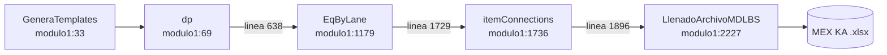

[Volver a la macro de entrada](README.md) · [Índice general](../README.md)

# Generación del export MEX KA

`GeneraTemplates` (`merged/modulo1.vba:33`) es el paso que convierte el Plan en las tres
hojas que LBS necesita, y las escribe en el archivo `MEX KA PLANTS_Restos_v*.xlsx`.

No es una macro monolítica sino una cadena de cuatro, encadenadas por llamada directa:



`GeneraTemplates` en sí solo muestra las hojas de trabajo, apaga el cálculo automático y
llama a `dp` (`merged/modulo1.vba:33-65`, la llamada en la línea 63). El trabajo real está en las cuatro etapas.

Para reconstruir las hojas internas **sin** tocar el archivo MEX KA existe
`GeneraTemplatesBuildOnly` (`merged/modulo1.vba:27-31`), que enciende la bandera pública
`LBS_SkipLlenadoArchivoMDLBS` y la vuelve a apagar al terminar. Útil para revisar el STR
antes de comprometerlo.

## Etapa 1: `dp` — construir `stockTransportRequests`

`merged/modulo1.vba:69`

Convierte cada renglón exportable del Plan en una o más filas de STR.

### Preparación

1. Quita el autofiltro de las siete hojas que va a leer (`merged/modulo1.vba:129-137`).
2. Valida el cartonaje del Plan y aborta si hay fechas en `Plan!M`
   (`merged/modulo1.vba:143-148`).
3. Limpia la hoja `stockTransportRequests` desde la fila 2 (`merged/modulo1.vba:151-156`).

### Columnas auxiliares internas

`dp` usa tres columnas de trabajo que **no** se copian al MEX KA
(`merged/modulo1.vba:118-120`):

| Columna | Constante | Contenido |
|---|---|---|
| `AX` | `COL_FLAG_SPECIAL` | 1 si es un pedido Super Ofertas partido (material especial y `Plan!N > 35`) |
| `AY` | `COL_TARIMAS_PARTE` | Número de tarimas de esa parte |
| `AZ` | `COL_PLAN_ROW` | Número de fila del `Plan` que originó el registro |

`AZ` es la más importante de las tres: es el hilo que permite volver del STR al Plan para
resolver fechas, item id y clase de consolidación en las pasadas posteriores. También la usa
`ValidarExportMEXKA` para comparar cada fila del STR contra su renglón de origen.

### Filtro de exportabilidad

Solo se procesan los renglones que pasan `LBS_PlanRowExportable`
(`merged/modulo1.vba:166`, definida en `merged/modulo1.vba:863`). Esa función aplica los
mismos requisitos obligatorios que `ValidarDestinos`, y excluye los renglones con
`NoInventario`, `FaltaInventario` o `FABRICA` en `Plan!F`.

### Mapeo básico Plan → STR

| Columna del STR | Contenido | Cita |
|---|---|---|
| `A` | `Order ID`. Es `Plan!J` más un sufijo `_N` de contador global | `merged/modulo1.vba:239` |
| `B` | `Lane Id`, en formato `<origen>_<destino>` | `merged/modulo1.vba:341` |
| `D` | `Stock Transport Request ID`. El mismo valor que `A` | `merged/modulo1.vba:240` |
| `E` | `Quantity`, tomado de `Plan!AA` | `merged/modulo1.vba:242` |
| `F` | `Item Id` | `merged/modulo1.vba:390-391` |
| `H` | Constante `"4"` | `merged/modulo1.vba:297` |
| `I` | Constante `"1"` | `merged/modulo1.vba:298` |
| `J` | `Group Id` | ver más abajo |
| `K` | Constante `"FALSE"` | `merged/modulo1.vba:299` |
| `L` | `Is Urgent`. Se pone en `"TRUE"` cuando `Quantity > 2300` | `merged/modulo1.vba:2346-2352` |
| `O` | Constante `"FALSE"` | `merged/modulo1.vba:300` |
| `P` | Vigencia (mismo valor que `W`) | `merged/modulo1.vba:365-366` |
| `Q` | `Production work Order`. El mismo valor que `A` | `merged/modulo1.vba:241` |
| `R` | Temporal: destino final. **Se borra al final** | `merged/modulo1.vba:497`, `582` |
| `V` | `Start Time` | ver más abajo |
| `W` | `End Time` | ver más abajo |
| `AA` | Constante `"FALSE"` | `merged/modulo1.vba:301` |
| `AB` | `Consolidation Class` | ver más abajo |

Nótese que `Is Urgent` se escribe hasta `LlenadoArchivoMDLBS`, directamente sobre el archivo
MEX KA, no sobre la hoja interna.

### El partido de Super Ofertas

Cuando un renglón cumple la condición especial —material listado en `Condiciones Cadenas` y
más de 35 tarimas completas— `dp` no genera una fila de STR sino varias, cada una de hasta 35
tarimas (`merged/modulo1.vba:265-286`).

La cantidad de cada parte se reparte proporcionalmente:

```
Quantity de la parte = Round(qtyOriginal * (tarimasParte / tarimasTotales), 0)
```

(`merged/modulo1.vba:271`). Si `tarimasTotales` es cero se usa la cantidad completa
(`merged/modulo1.vba:273`).

Cada parte lleva su propio `Order ID` con sufijo distinto, la bandera en `AX` y el conteo de
tarimas en `AY`.

### Fechas: `Start Time` y `End Time`

`merged/modulo1.vba:320-374`

Es el bloque más delicado del STR porque LBS rechaza el archivo completo si las fechas no son
coherentes. La lógica, por cada fila:

1. Lee `Plan!D` como inicio y `Plan!L` como fin, usando la fila registrada en `AZ`.
2. **Fuerza que el fin no sea anterior al inicio** (`merged/modulo1.vba:330-339`). El
   comentario del código nombra el error que esto evita:
   *"LBS: EndTime must be >= StartTime (evita 'Invalid STR data. EndTime < StartTim')"*.
   Si solo hay una de las dos fechas, la copia a la otra.
3. **Ajusta el fin por tiempo de tránsito.** Consulta el diccionario de tránsito por carril
   (`LBS_LoadExportConnectionTransitDict`) y, mientras las horas entre inicio y fin no
   alcancen el tránsito del carril, empuja el fin un día
   (`merged/modulo1.vba:343-355`). Tiene una guarda de 365 iteraciones para no colgarse.
4. **Si `Plan!W1` está activo**, topa el inicio al mínimo `Plan!D` exportable
   (`merged/modulo1.vba:357-360`), de modo que la disponibilidad de equipo cubra el rango.
5. Escribe con el formato de fecha que espera LBS:
   - `W` (`End Time`) como `MM/DD/YYYY 9:00:00`
   - `P` (vigencia) igual que `W`
   - `V` (`Start Time`) como `MM/DD/YYYY 0:00:00`

Las tres columnas se formatean como texto (`NumberFormat = "@"`) antes de escribirse
(`merged/modulo1.vba:306-310`), porque LBS espera **mes/día/año** y dejarlas como fecha
haría que Excel las reinterprete según la configuración regional.

Al terminar, una pasada de verificación reparsea los textos y avisa si algún inicio quedó
en o después del fin (`merged/modulo1.vba:591-615`), con el mensaje
*"Hay fechas de start mayores a la vigencia en el stockTransportRequests"*. Es un aviso, no
un aborto.

### `Item Id`

La regla base es concatenar el material con el sufijo de la cadena:

```
Item Id = Plan!T & "_" & LEFT(Plan!G, 3)
```

(`merged/modulo1.vba:380-391`). Pero `LEFT(cadena, 3)` produce basura para varias cadenas
—el caso clásico es `"LA "` para `LA COMER`— así que hay una tabla de excepciones en
`LBS_CadenaItemSuffix` (`merged/modulo1.vba:963-985`). La tabla completa está en
[cadenas/README.md](cadenas/README.md).

El orden de preferencia real es:

1. La columna `E` (`LBS Item Id`) de `ArmadoChep`, si existe la fila.
2. El sufijo de `LBS_CadenaItemSuffix`.
3. `LEFT(cadena, 3)` como último recurso.

Además, el tipo de tarima puede sobreescribir el resultado: para tarima plástica o madera,
algunas cadenas usan el SKU desnudo sin sufijo. Antes de resolver el item id, `dp` recalcula
`Plan!AD` explícitamente (`merged/modulo1.vba:386-388`) porque la macro corre con cálculo
manual y esa columna suele ser una fórmula.

### `Consolidation Class` (columna `AB`)

`merged/modulo1.vba:501-579`

Le dice a LBS qué filas puede juntar en un mismo embarque. La lógica está documentada como
comentario en el propio código (`merged/modulo1.vba:502-510`) y se evalúa en este orden:

| Prioridad | Condición | Valor de `AB` |
|---|---|---|
| 1 | El `Group Id` (col `J`) empieza con `EXC28_` | La columna `D` (el STR ID). Mantiene atómico el camión de 28 tarimas de Walmart |
| 2 | Es Super Ofertas partido y la parte es de exactamente 35 tarimas | La columna `D` |
| 3 | El destino está en `Inseparable!C`, **o** la cadena es CHEDRAUI | `Plan!J` (el pedido) |
| 4 | El destino es `400101621` (OXXO Monterrey) | `Plan!F & "_" & Plan!H` (origen + CEDIS) |
| 5 | La cadena es LA COMER y `Plan!W` es `R` o `C` | `laneId & "_" & confRC` |
| 6 | Cualquier otro caso | La columna `B` (el carril) |

Los casos 1 y 2 usan el ID del propio STR como clase, lo que significa "esta fila no se
consolida con nada". Es la forma de garantizar que un camión completo llegue intacto.

El caso 3 con Chedraui tiene su razón anotada: *"multi-SKU por pedido; evita minEfficiency en
lane"* (`merged/modulo1.vba:508`). Consolidar Chedraui por carril en lugar de por pedido hacía
que LBS descartara pedidos completos por eficiencia mínima.

Para calcular estas reglas, `dp` usa la columna `R` como escratch con el destino final, y la
borra al terminar junto con `AC` (`merged/modulo1.vba:582-584`).

## Etapa 2: `EqByLane` — construir `EquipmentByLaneByDay`

`merged/modulo1.vba:1179`

Declara qué equipo está disponible en cada carril y en cada día del horizonte. Sin esta hoja,
LBS no tiene con qué mover nada.

### Secuencia

1. **Refresca el catálogo sobre `Handling`** antes de leer los cupos, para que los cupos
   activos correspondan al catálogo vigente.
2. **Calcula la fórmula de la columna `G` de `Handling`** como `MAX(L:O)`
   (`merged/modulo1.vba:1272-1274`).
3. **Recorre los carriles** del STR y, para cada uno, resuelve del catálogo Mode Mix el modo
   (`Sencillo`/`Full`), el especializado y el `Pallets Max`.
4. **Elige el ID de equipo** con `LBS_EqFullCajaId` / `LBS_EqFullEncortId`
   (`merged/modulo1.vba:330-331`) o los equivalentes del catálogo
   `LBS_CatalogFullEqIdCaja` / `LBS_CatalogFullEqIdEncort`
   (`merged/modulo4.vba:187-188`), según el `Pallets Max` y si la cadena es OXXO.
5. **Expande por día** con `LBS_ExpandEquipmentByDay`, generando una fila por carril y por día
   del rango.

### Ventana de fechas

El rango de días depende de las banderas:

| Situación | Ventana |
|---|---|
| Normal | `EBL End = Date + rangofechas`, a las 0:00 |
| `Plan!W1` activo | Unión de los rangos del STR y de `Plan!D..L`, más límite de carga alto |
| `Plan!V1` activo y `W1` apagado | El fin llega al menos a `Date + 120`; el inicio nunca queda después de hoy |

Las funciones que lo resuelven son `LBS_StrEquipDateRange`,
`LBS_EquipAvailabilityWindow`, `LBS_MinExportablePlanStartDate` y
`LBS_MaxExportablePlanEndDate` (`merged/modulo1.vba:645`, `678`, `768` y `790`).

### Reglas de cadena que se aplican aquí

- **Cadenas de solo sencillo** (Soriana, City Club, City Fresko): `EqByLane` no emite filas
  de Full. Ver [cadenas/soriana-city-club.md](cadenas/soriana-city-club.md).
- **Destinos OXXO solo Full**: no emite filas de sencillo. Ver
  [cadenas/oxxo.md](cadenas/oxxo.md).
- **Walmart**: el equipo de 28 tarimas `Z4290_WAL` se declara solo aquí, nunca en el STR.
  Ver [cadenas/walmart.md](cadenas/walmart.md).

`LBS_CadenaEnforceCatalogBodyType` (`merged/modulo1.vba:1148-1149`) devuelve siempre
verdadero, lo que significa que **todas** las cadenas usan el especializado y el `Pallets Max`
del catálogo. El comentario aclara que Walmart y las cadenas de solo sencillo siguen sin
emitir Full por las reglas anteriores.

Hay un aviso desactivado en el código: la línea que advertía sobre fechas de inicio mayores a
la vigencia en el EBL está comentada (`merged/modulo1.vba:1712`).

## Etapa 3: `itemConnections`

`merged/modulo1.vba:1736`

Deduplica los items del STR y genera una fila por combinación item + carril con los atributos
físicos que LBS necesita: niveles de tarima, capas y reglas de apilado.

Consulta la hoja `Condiciones Cadenas` para las particularidades por cadena. La regla más
notable es la de Walmart: los items de split de restos (`LBS_IsWalmartSplitRestosItem`,
`merged/modulo1.vba:1038-1052`) salen con `Level` y `Layer` vacíos y `PalletLevel = 2`.
Ver [cadenas/walmart.md](cadenas/walmart.md).

El rango que se copia al MEX KA es `A2:O`, quince columnas
(`merged/modulo1.vba:2334`).

## Etapa 4: `LlenadoArchivoMDLBS`

`merged/modulo1.vba:2227`

Abre el archivo MEX KA, pega las tres hojas, sincroniza `connections`, parcha los maestros
faltantes y guarda.

### Resolución del archivo

`GT_ResolveMEXKAForLlenado` (`merged/modulo1.vba:2065`) busca el archivo con el
patrón `MEX KA PLANTS*Restos*v*.xlsx` en la carpeta del libro y en `data\`
(`merged/modulo6.vba:851-909`). Si no lo encuentra, abre un diálogo de selección. Si el
operador cancela, muestra
*"No se seleccionó ningún archivo. El proceso se cancelará."*
(`merged/modulo1.vba:2250`).

Ignora los archivos de bloqueo de Excel (`~$...`) mediante
`LBS_IsExcelOwnerLockFile` (`merged/modulo6.vba:984`).

### La guarda de Plan vacío

Antes de escribir nada, cuenta las filas de las tres hojas internas y si alguna tiene menos
de 2 filas, **cancela sin tocar el MEX KA** (`merged/modulo1.vba:2292-2301`):

```
"Llenado cancelado: el Plan no tiene datos para exportar.

STR filas=N  EquipmentByLane=N  itemConnections=N

Ejecute GeneraTemplates completo (STR + EqByLane + itemConnections) antes de llenar el MEX KA.
El archivo MEX KA no se modifico."
```

Esta guarda existe justamente por el escenario contrario: sobrescribir un MEX KA bueno con
un `GeneraTemplates` incompleto. El comentario lo dice tal cual:
*"No sobrescribir un MEX KA bueno con Plan vacio / GeneraTemplates incompleto"*
(`merged/modulo1.vba:2292`).

### Secuencia de escritura

| Paso | Qué hace | Cita |
|---|---|---|
| 1 | `GT_CleanExportAuxRows` quita las filas auxiliares vacías del template | `merged/modulo1.vba:2261` |
| 2 | Desactiva el autofiltro de todas las hojas del MEX KA | `merged/modulo1.vba:2266-2270` |
| 3 | Limpia y pega `stockTransportRequests`, rango `A2:AB` | `merged/modulo1.vba:2276-2313` |
| 4 | Copia `EquipmentByLaneByDay` **por encabezado**, no por posición | `merged/modulo1.vba:2321-2322` |
| 5 | Limpia y pega `itemConnections`, rango `A2:O` | `merged/modulo1.vba:2328-2335` |
| 6 | `LBS_SyncConnectionsFromBodDetail` sincroniza los carriles a `connections` | `merged/modulo1.vba:2341` |
| 7 | Marca `Is Urgent` (col `L`) en `TRUE` cuando `Quantity > 2300` | `merged/modulo1.vba:2346-2352` |
| 8 | Vuelve a limpiar filas auxiliares y borra el horizonte de planeación | `merged/modulo1.vba:2355-2356` |
| 9 | `LBS_PatchExportMasterGaps` agrega items y facilities faltantes | `merged/modulo1.vba:2359` |
| 10 | Cierra guardando y activa `User Guide` en el libro anfitrión | `merged/modulo1.vba:2362-2368` |

El paso 4 merece atención. El comentario explica por qué no se puede copiar por posición:
*"EquipmentByLaneByDay: map by header. Working LBS templates have extra cols E-G (Group ID /
loading type) so B:L -> B2 shifts Start/End/Load Limit"*
(`merged/modulo1.vba:2319-2320`). Distintas versiones del template de LBS tienen columnas
extra, y copiar por posición desplazaba las fechas y el límite de carga.
`LBS_LlenadoCopyEblByHeader` (`merged/modulo1.vba:2148`) resuelve la
correspondencia por nombre de encabezado.

El paso 6 es el que evita el error `Invalid Connection Id` de LBS: recorre los carriles que
aparecen en `BodDetail_ABPP`, en el STR y en `itemConnections`, y agrega a la hoja
`connections` del MEX KA los que falten.

El paso 9, `LBS_PatchExportMasterGaps` (`merged/modulo6.vba:1127`), atiende el otro par de
errores clásicos: `Invalid Item` y `Missing facility`. El STR puede referenciar items o
destinos que no existen en las hojas maestras del export, y este paso los clona a partir de
una fila plantilla.

### Mensajes de cierre

| Mensaje | Significado |
|---|---|
| *"EQbyLane, StockTransReq, itemConn y connections (BodDetail/STR) completados."* (`merged/modulo1.vba:2365`) | Éxito. El MEX KA quedó escrito y guardado |
| *"No se pudo abrir el archivo MEX KA: ..."* (`merged/modulo1.vba:2372`) | Está abierto por otro, bloqueado, o la ruta no es accesible |
| *"Error en LlenadoArchivoMDLBS (N): ..."* (`merged/modulo1.vba:2377`) | Error inesperado; el número y la descripción vienen de VBA |

## Hojas del MEX KA que escribe esta etapa

| Hoja | La escribe | Rango |
|---|---|---|
| `stockTransportRequests` | Etapa 4, paso 3 | `A2:AB` |
| `equipmentByLaneByDay` | Etapa 4, paso 4 | Por encabezado |
| `itemConnections` | Etapa 4, paso 5 | `A2:O` |
| `connections` | Etapa 4, paso 6 | Solo agrega faltantes |
| `items` | Etapa 4, paso 9 | Solo agrega faltantes |
| `itemPackage` | Etapa 4, paso 9 | Solo agrega faltantes |
| `facilities` | Etapa 4, paso 9 | Solo agrega faltantes |
| `plans` | Etapa 4, paso 8 (lo limpia) | — |

El horizonte de planeación de la hoja `plans` se **borra** aquí a propósito
(`GT_ClearExportHorizon`, `merged/modulo1.vba:2356`) y lo vuelve a llenar
`LBS_FillExportPlanningHorizon` (`merged/modulo6.vba:1517`) durante la validación, ya con la
fecha mínima real del STR. Si se importa a LBS sin haber corrido `ValidarExportMEXKA`, la
hoja `plans` puede quedar sin horizonte.

## Siguiente paso

Nunca importar a LBS directo desde aquí. Correr
[`ValidarExportMEXKA`](06-validaciones-mexka.md) primero.
