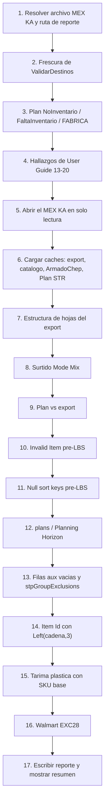

[Volver a la macro de entrada](README.md) · [Índice general](../README.md)

# `ValidarExportMEXKA` — catálogo de validaciones

`merged/modulo6.vba:156`

Es la compuerta antes de importar a LBS. Abre el archivo MEX KA en solo lectura, corre unas
49 reglas distintas sobre el Plan y sobre el export, y escribe el resultado en
`data\mex_ka_validation_report.txt`.

Cada regla puede producir mensajes **OK** (informativos, confirman que algo está bien) o
**hallazgos** (algo que hay que corregir). El resumen final muestra los conteos de ambos y
los primeros cinco hallazgos.

**La meta es cero hallazgos.** Cada hallazgo ignorado se convierte en un `Order Failure` de
LBS o en un embarque mal armado.

## Parámetros del validador

| Constante | Valor | Qué controla | Cita |
|---|---|---|---|
| `LBS_VALEXP_MAX_HEIGHT_M` | `2.5` | Altura máxima admisible de un item en `itemPackage`, en metros | `merged/modulo6.vba:11` |
| `LBS_VALEXP_MAX_ISSUES_PER_RULE` | `20` | Cuántos hallazgos detallados imprime cada regla antes de resumir en un solo mensaje de conteo | `merged/modulo6.vba:12` |
| `LBS_VALEXP_VERSION` | `"itempackage-gap-v1"` | Versión del validador; se puede consultar con `LBS_ValExp_GetVersion` | `merged/modulo6.vba:22` |

El tope de 20 explica por qué muchos hallazgos vienen en pares: primero hasta 20 mensajes con
el detalle fila por fila, y al final un mensaje con el conteo total. Cuando se vea
`"N filas con ... (max 20 detalladas)"`, el reporte no está incompleto: hay N problemas y
solo se detallaron 20.

## Orden de ejecución

`merged/modulo6.vba:194-243`. La variable `valStep` va registrando la etapa, y si algo
explota el mensaje de error la incluye, lo cual ayuda mucho a ubicar el problema.



Las etapas 2, 3 y 4 corren **antes** de abrir el MEX KA: son validaciones del libro de
planeación. Las demás necesitan el export abierto.

## Errores de arranque

Estos dos aparecen como cuadro de diálogo y la macro sale sin generar reporte:

| Mensaje | Causa | Remedio |
|---|---|---|
| `No se selecciono export MEX KA (.xlsx).` (`merged/modulo6.vba:175`) | No se pudo resolver el archivo automáticamente y se canceló el diálogo | Verificar que exista un `MEX KA PLANTS*Restos*v*.xlsx` en la carpeta del libro o en `data\` |
| `No se selecciono carpeta para reportes.` (`merged/modulo6.vba:181`) | No hay dónde escribir el reporte. Típico cuando el libro está en una ruta web | Abrir el libro desde disco local, o elegir una carpeta en el diálogo |
| `No se pudo abrir export MEX KA: <ruta>` (`merged/modulo6.vba:208`) | El archivo está abierto por otro usuario o bloqueado | Cerrarlo y reintentar |
| `Error al validar export MEX KA (<etapa>): <descripción> (<número>)` (`merged/modulo6.vba:279`) | Error inesperado. La etapa indica dónde | Ver la etapa en el diagrama de arriba |

## Grupo 1 — Frescura y estado del Plan

| Mensaje | Causa | Remedio |
|---|---|---|
| `Ejecute ValidarDestinos (boton antes de Asignar Origen) antes de ValidarExportMEXKA` (`merged/modulo6.vba:198`) | `Plan!X1` no contiene el texto `ValidarDestinos: listo`. La verificación está en `LBS_ValExp_ValidarDestinosRan` (`merged/modulo6.vba:3413-3417`) | Correr `ValidarDestinos` y esperar a que termine |
| `Plan fila N NoInventario: dest=... item=... (no exportar; ejecutar CambioOrigen o revisar inventario)` (`merged/modulo6.vba:3446`) | `CambioOrigen` no encontró inventario para ese renglón | Revisar los inventarios cargados, o aceptar que el renglón no se embarca |
| `Plan fila N FaltaInventario: dest=... item=... (no exportar)` (`merged/modulo6.vba:3453`) | Se cubrió parcialmente | Igual que el anterior |
| `Plan fila N FABRICA: dest=... item=... (CambioOrigen no asigno planta; no exportar)` (`merged/modulo6.vba:3460`) | No hay planta candidata. Casi siempre falta la fila en `Logica Origen` | Agregar el destino + item en `Logica Origen` y volver a correr `CambioOrigen` |
| `Plan: N filas NoInventario (max 20 detalladas)` (`merged/modulo6.vba:3470`) | Resumen del anterior | — |
| `Plan: N filas FaltaInventario (max 20 detalladas)` (`merged/modulo6.vba:3473`) | Resumen | — |
| `Plan: N filas FABRICA (max 20 detalladas)` (`merged/modulo6.vba:3476`) | Resumen | — |

El mensaje OK correspondiente es
`Plan: sin filas NoInventario / FaltaInventario / FABRICA` (`merged/modulo6.vba:3467`).
Ver [04-cambio-origen.md](04-cambio-origen.md#las-tres-marcas-de-fallo).

## Grupo 2 — Hallazgos heredados de `User Guide`

`LBS_ValExp_AppendUserGuideChecks` (`merged/modulo6.vba:3481-3529`) lee las filas de
hallazgos que dejó `ValidarDestinos` y las convierte en hallazgos del reporte
(`merged/modulo6.vba:3496-3526`).

| Mensaje | Causa | Remedio |
|---|---|---|
| `User Guide: hoja no encontrada (ValidarDestinos)` (`merged/modulo6.vba:3496`) | Falta la hoja `User Guide` | Restaurar la hoja del libro plantilla |
| `<etiqueta>: <valor>` (`merged/modulo6.vba:3519`) | Un hallazgo individual de la fila | Ver la tabla de abajo |
| `<etiqueta>: N hallazgos (ver User Guide G<fila>:AZ<fila>)` (`merged/modulo6.vba:3526`) | Más de 20 hallazgos en esa fila | Abrir la hoja `User Guide` y revisar el rango indicado |
| `<etiqueta>: (ninguno)` (`merged/modulo6.vba:3524`) | OK | — |

Las etiquetas corresponden a las filas de `User Guide`:

| Fila | Etiqueta aproximada | Remedio |
|---|---|---|
| 13 | Destinos/items sin `Logica Origen` | Agregar en `Logica Origen` |
| 15 | Destinos sin `Handling` | Agregar en `Handling`, o `Sync_Step1_PlanDestinosSetup` |
| 16 | Items que no están en LBS ni en `ArmadoMadera` | Agregar en `ArmadoMadera`, o `Sync_Step2_PlanItemsSetup` |
| 17 | Destinos que no están en LBS ni tienen tarima | Agregar en `TarimaPorDestino` |
| 18 | Pedidos destino CHEP sin armado | Agregar en `ArmadoChep`, o `SincronizarCatalogoHomologado` |
| 19 | Destino con cadena inseparable | Revisar la regla en `Inseparable` |
| 20 | Carriles del Plan sin catálogo Mode Mix | Agregar el carril al `Catalogo Mode Mix` |

## Grupo 3 — Estructura de hojas del export

`LBS_ValidateExportWorkbook` (`merged/modulo6.vba:1041-1071`)

| Mensaje | Causa | Remedio |
|---|---|---|
| `Falta hoja stockTransportRequests en export` (`merged/modulo6.vba:1043`) | El archivo MEX KA no es el template correcto, o está corrupto | Partir de una copia limpia del template |
| `Falta hoja equipmentByLaneByDay` (`merged/modulo6.vba:1052`) | Igual | Igual |
| `Faltan hojas connections o itemConnections` (`merged/modulo6.vba:1058`) | Igual | Igual |
| `plans: hoja no presente en export` (`merged/modulo6.vba:1070`) | Falta la hoja de parámetros del horizonte | Igual |

Cuando aparece cualquiera de estos cuatro, no vale la pena revisar el resto del reporte: el
archivo no es un MEX KA válido.

## Grupo 4 — `stockTransportRequests`

`LBS_ValExp_STR` (`merged/modulo6.vba:1734-1772`)

| Mensaje | Causa | Remedio |
|---|---|---|
| `STR: Start/End vacio fila N orden X (LBS k1 null)` (`merged/modulo6.vba:1734`) | Una fila del STR quedó sin fechas. LBS falla con un error de clave nula | Revisar `Plan!D` y `Plan!L` del renglón; volver a correr `GeneraTemplates` |
| `STR: Start>=End fila N orden X` (`merged/modulo6.vba:1741`) | La fecha de carga es posterior o igual a la vigencia | Corregir `Plan!D` o `Plan!L` |
| `STR: N filas con Start>=End (max 20 detalladas)` (`merged/modulo6.vba:1765`) | Resumen | — |
| `STR: Start/End no fecha fila N orden X` (`merged/modulo6.vba:1748`) | El valor no se pudo interpretar como fecha | Revisar el formato de las fechas del Plan |
| `STR: Item Id vacio fila N orden X` (`merged/modulo6.vba:1756`) | No se pudo resolver el item id | Revisar `ArmadoChep` para esa cadena + SKU |
| `STR: N filas con Item Id vacio` (`merged/modulo6.vba:1770`) | Resumen | — |

Mensajes OK del grupo: `STR: Start Time < End Time en filas revisadas`
(`merged/modulo6.vba:1763`), `STR: Item Id informado en filas revisadas`
(`merged/modulo6.vba:1768`) y `stockTransportRequests: ~N lanes, N filas`
(`merged/modulo6.vba:1772`), que sirve como conteo de control.

## Grupo 5 — `equipmentByLaneByDay`

`LBS_ValExp_Equipment` (`merged/modulo6.vba:1829-1854`)

Se concentra en OXXO, que es la cadena con la regla más rígida.

| Mensaje | Causa | Remedio |
|---|---|---|
| `equipmentByLaneByDay: sin filas OXXO dest=X origen=Y` (`merged/modulo6.vba:1834`) | El destino OXXO está en el Plan pero `EqByLane` no generó equipo para ese carril | Revisar el carril en el `Catalogo Mode Mix` y las banderas de planta en `Handling` |
| `OXXO dest=X Y: incluye sencillo Z5290` (`merged/modulo6.vba:1842`) | Un destino OXXO de solo-Full tiene equipo sencillo declarado | Correr `HandlingOXXOFullMetro` y regenerar |
| `OXXO dest=X Y: sin Z3500/Z2550` (`merged/modulo6.vba:1844`) | Falta el equipo Full esperado | Igual |

Mensajes OK: `OXXO dest=X Y: solo Full` (`merged/modulo6.vba:1840`),
`OXXO dest=X: no en plan (N/A Full)` (`merged/modulo6.vba:1829`),
`WM: revisar N lane(s) con Full en destinos WM` (`merged/modulo6.vba:1852`) y
`WM: N registros Z4260/Z4290_WAL (sencillo esperado)` (`merged/modulo6.vba:1854`).

Los dos de Walmart son informativos a propósito: sirven para que el operador confirme
visualmente que el conteo de equipo de Walmart tiene sentido. Ver
[cadenas/walmart.md](cadenas/walmart.md) y [cadenas/oxxo.md](cadenas/oxxo.md).

## Grupo 6 — Catálogo Mode Mix contra el export

`LBS_ValExp_CheckCatalogModeMix` (`merged/modulo6.vba:2039-2054`)

| Mensaje | Causa | Remedio |
|---|---|---|
| `Catalogo: lane X_Y espera Sencillo pero export tiene Full` (`merged/modulo6.vba:2039`) | El catálogo dice `S` pero `EqByLane` emitió Full | Revisar el modo en el catálogo, o los cupos activos de `Handling` |
| `Catalogo: lane X_Y espera Full pero export no tiene Z3500/Z2550` (`merged/modulo6.vba:2042`) | El catálogo dice `F` pero no hay equipo Full | Igual |
| `Catalogo: lane X_Y espera Full pero export incluye sencillo (Z5290/Z1290/Z4290)` (`merged/modulo6.vba:2045`) | Mezcla de modos en un carril de solo Full | Igual |
| `Catalogo Mode Mix: N lane(s) con modo distinto al catalogo` (`merged/modulo6.vba:2054`) | Resumen | — |

OK: `Catalogo Mode Mix: N lane(s) alineados con export` (`merged/modulo6.vba:2053`).

### Tipo de carrocería y `Pallets Max`

`merged/modulo6.vba:2135-2193`. Seis variantes del mensaje
`Catalog body: lane X_Y ...`, que comparan el especializado (caja seca o encortinado) y el
`Pallets Max` del catálogo contra el ID de equipo que quedó en el export.

| Mensaje | Causa | Remedio |
|---|---|---|
| `Catalog body: lane X_Y ...` (`merged/modulo6.vba:2135`, `2146`, `2162`, `2170`, `2181`, `2185`) | El equipo del export no corresponde al especializado o al cupo del catálogo | Refrescar el catálogo sobre `Handling` con `ValidarDestinos` y regenerar |
| `Catalog Full body/Pallets Max: N lane(s) distintos al catalogo` (`merged/modulo6.vba:2193`) | Resumen | — |

OK: `Catalog Full body/Pallets Max: N lane(s) alineados` (`merged/modulo6.vba:2192`).

## Grupo 7 — Paridad con el surtido

`LBS_ValExp_CheckSurtidoModeMix` (`merged/modulo6.vba:1920-1994`)

Compara el catálogo contra un archivo de surtido `.tsv` que se busca junto al export. Sirve
para detectar carriles que el catálogo marca como Full pero que en la práctica se están
armando en sencillo.

| Mensaje | Causa | Remedio |
|---|---|---|
| `Surtido: lane X catalogo F pero N fila(s) Programado en Sencillo sin Full` (`merged/modulo6.vba:1980`) | Discrepancia real entre catálogo y operación | Decidir cuál es correcto y alinear el catálogo o la operación |
| `Surtido Mode Mix: N lane(s) F armadas solo en Sencillo` (`merged/modulo6.vba:1989`) | Resumen | — |
| `Surtido Mode Mix: no se pudo leer <ruta>` (`merged/modulo6.vba:1994`) | El archivo existe pero no se pudo abrir | Verificar permisos y que no esté abierto |

Mensajes OK que indican que la regla se omitió:
`Surtido Mode Mix: archivo surtido no encontrado junto al export (omitido)`
(`merged/modulo6.vba:1920`) y
`Surtido Mode Mix: surtido .xlsx no soportado en validador (use .tsv)`
(`merged/modulo6.vba:1924`). El validador **solo lee `.tsv`**; si el surtido está en `.xlsx`
hay que exportarlo a TSV para que esta regla aplique.

## Grupo 8 — `connections`

`LBS_ValExp_Connections` (`merged/modulo6.vba:2257-2274`)

| Mensaje | Causa | Remedio |
|---|---|---|
| `connections: dest X en STR sin lane (Invalid Connection Id)` (`merged/modulo6.vba:2259`) | Hay un destino en el STR sin carril en `connections`. LBS falla con `Invalid Connection Id` | Correr `Sync_Step5_ExportConnections`, o revisar `BodDetail_ABPP` |
| `HEB 400170996: itemConnections OK pero connections vacio` (`merged/modulo6.vba:2266`) | Caso específico del destino HEB `400170996` | Correr `Sync_Step5_ExportConnections` |
| `HEB 400170996: en STR pero sin itemConnections` (`merged/modulo6.vba:2270`) | Igual, del otro lado | Regenerar con `GeneraTemplates` |

OK: `connections: dest X en STR y export` (`merged/modulo6.vba:2257`),
`HEB 400170996: STR + itemConnections + connections alineados` (`merged/modulo6.vba:2268`) y
`itemConnections: N filas destinos OXXO metro` (`merged/modulo6.vba:2274`).

El destino HEB `400170996` tiene reglas propias porque históricamente fue el caso donde se
detectó el problema de `connections` vacío.

## Grupo 9 — Items, packages y alturas

| Mensaje | Causa | Remedio |
|---|---|---|
| `items: faltan N NETO en hoja items` (`merged/modulo6.vba:2328`) | De los 15 items NETO esperados falta alguno | Correr `Sync_Step4_ExportItems` |
| `<hoja>: N items Height > 2.5m; ej: ...` (`merged/modulo6.vba:2388`) | Alguna altura de `itemPackage` supera el tope. Casi siempre es una altura en centímetros mal escalada | Correr `SincronizarCatalogoHomologado`, que tiene una corrección automática de cm a m |
| `<hoja>: columna Height sin Item Id` (`merged/modulo6.vba:2360`) | Hay alturas sin item asociado | Limpiar las filas huérfanas del `itemPackage` |

OK: `items NETO: no hay pedidos NETO en plan (N/A)` (`merged/modulo6.vba:2316`),
`items: 15 Item Id NETO en catalogo items` (`merged/modulo6.vba:2326`),
`<hoja>: alturas <= 2.5m` (`merged/modulo6.vba:2390`),
`<hoja>: N filas con Height` (`merged/modulo6.vba:2386`) y
`itemPackage: hoja no presente en export (N/A Height)` (`merged/modulo6.vba:2398`).

## Grupo 10 — Claves nulas antes de importar (`k1 null`)

`LBS_ValExp_CheckNullSortKeysForLBS` (`merged/modulo6.vba:2676-2743`) y
`LBS_ValExp_CheckAuxPlaceholderRows` (`merged/modulo6.vba:1662-1689`)

Este grupo existe por un error concreto de LBS: al importar, si algún campo clave viene
vacío, el motor de Java falla con una excepción de clave nula (`k1 null`) que **no dice qué
fila la causó**. Estas reglas encuentran el origen antes de importar.

| Mensaje | Causa | Remedio |
|---|---|---|
| `LBS k1 null (pre-import): <hoja> fila N Lane Id vacio` (`merged/modulo6.vba:2676`, `2703`) | Falta el carril en una fila del STR | Regenerar con `GeneraTemplates` |
| `LBS k1 null (pre-import): <hoja> fila N Item Id vacio orden X` (`merged/modulo6.vba:2683`, `2710`) | Falta el item id | Revisar `ArmadoChep` |
| `LBS k1 null (pre-import): <hoja> fila N Start Time vacio (col C)` (`merged/modulo6.vba:2689`, `2716`) | Falta la fecha de inicio | Revisar `Plan!D` |
| `LBS k1 null (pre-import): <hoja> fila N End Time vacio (col C)` (`merged/modulo6.vba:2695`, `2722`) | Falta la fecha de fin | Revisar `Plan!L` |
| `LBS k1 null (pre-import): <hoja> N campos vacios en STR (max 20 detallados)` (`merged/modulo6.vba:2729`) | Resumen | — |
| `LBS k1 null (solve): hoja <nombre> fila 2 vacia - borrar fila o ejecutar LlenadoArchivoMDLBS (LBS_CleanExportAuxPlaceholderRows)` (`merged/modulo6.vba:1662`) | Una hoja auxiliar del template (`timeWindows`, `businessHourIDs`, …) tiene una fila 2 vacía que LBS intenta leer | Borrar esa fila, o volver a correr `LlenadoArchivoMDLBS` que la limpia |
| `stpGroupExclusions: N filas con Location Id vacio (LBS solve k1 null) - revisar template LBS o completar Location Id` (`merged/modulo6.vba:1687`) | Exclusiones de agrupación sin ubicación | Completar el `Location Id` o borrar las filas |

OK: `LBS k1 null: STR Plan+export con Lane/Item/Start/End informados`
(`merged/modulo6.vba:2743`),
`Export aux: sin filas placeholder vacias (timeWindows, businessHourIDs, ...)`
(`merged/modulo6.vba:1668`) y
`stpGroupExclusions: Location Id informado` (`merged/modulo6.vba:1689`).

## Grupo 11 — `Invalid Item` antes de importar

`LBS_ValExp_CheckInvalidItemsForLBS` (`merged/modulo6.vba:3209-3258`) y
`LBS_ValExp_CheckPlanSTRItemIdMismatch` (`merged/modulo6.vba:3168-3205`)

El otro grupo de errores clásicos de LBS. Un `Item Id` que no existe en la hoja `items`
provoca `Invalid Item`; si existe en `items` pero no en `itemPackage`, provoca
`Missing Item Package`.

| Mensaje | Causa | Remedio |
|---|---|---|
| `LBS Invalid Item (pre-import): <hoja> '<item>' no esta en hoja items del export` (`merged/modulo6.vba:2847`) | El STR referencia un item que no está en el maestro del export | Correr `Sync_Step4_ExportItems` |
| `LBS Invalid Item (pre-import): <hoja> N Item Id faltantes en items (max 20 detallados)` (`merged/modulo6.vba:2862`) | Resumen | — |
| `LBS Invalid Item (pre-import): <hoja> Item Id <item> (sufijo Left cadena incorrecto; usar LAC/OXX en ArmadoChep)` (`merged/modulo6.vba:2838`) | El item id se armó con `LEFT(cadena,3)` en lugar del sufijo correcto | Agregar la fila en `ArmadoChep` con el `LBS Item Id` correcto en la columna `E` |
| `LBS Invalid Item (pre-import): <hoja> N Item Id con sufijo Left(cadena,3) roto` (`merged/modulo6.vba:2868`) | Resumen | — |
| `LBS Invalid Item (pre-import): SKU base <sku> - catalogo tiene variantes con sufijo; Plan Tarima Chep + ArmadoChep (ej. <sku>_OXX)` (`merged/modulo6.vba:2853`) | El STR usa el SKU desnudo pero el catálogo tiene variantes con sufijo | Corregir `Plan!AD` (tipo de tarima) o agregar la fila en `ArmadoChep` |
| `LBS Invalid Item (pre-import): <hoja> N SKU base con variantes en items (max 20 detallados)` (`merged/modulo6.vba:2865`) | Resumen | — |
| `LBS Invalid Item (pre-import): Plan STR fila N Item Id '<actual>' != esperado '<esperado>' (Plan fila M; re-ejecutar GeneraTemplates)` (`merged/modulo6.vba:3170`, `3194`) | El item id del STR no coincide con lo que resolvería `LBS_ResolveItemIdFromPlanRow` ahora. Suele pasar cuando cambió `ArmadoChep` después de generar | Volver a correr `GeneraTemplates` |
| `LBS Invalid Item (pre-import): N filas Plan STR con Item Id distinto al esperado (max 20 detallados)` (`merged/modulo6.vba:3205`) | Resumen | — |
| `LBS Missing Item Package (pre-import): <hoja> '<item>' esta en items pero no en itemPackage` (`merged/modulo6.vba:2898`) | Falta el registro de empaque | Correr `Sync_Step4_ExportItems` o `SincronizarCatalogoHomologado` |
| `LBS Missing Item Package (pre-import): <hoja> N Item Id sin package (max 20 detallados)` (`merged/modulo6.vba:2905`) | Resumen | — |
| `LBS Invalid Item (pre-import): export sin hoja items o sin Item Id` (`merged/modulo6.vba:3227`) | La hoja `items` está vacía | El export no es válido |
| `LBS Missing Item Package (pre-import): export sin hoja itemPackage o sin filas` (`merged/modulo6.vba:3233`) | La hoja `itemPackage` está vacía | Igual |

OK: `LBS Invalid Item (pre-import): todos los Item Id STR estan en hoja items`
(`merged/modulo6.vba:3250`),
`LBS Missing Item Package (pre-import): todos los Item Id STR en items tienen itemPackage`
(`merged/modulo6.vba:3256`) y
`Plan STR Item Id coincide con LBS_ResolveItemIdFromPlanRow` (`merged/modulo6.vba:3203`).

## Grupo 12 — Sufijos de item mal construidos

`LBS_ValExp_CheckChepLeftFallbackItemIds` (`merged/modulo6.vba:3332-3355`) y
`LBS_ValExp_ScanItemsForBrokenSuffix` (`merged/modulo6.vba:3385-3404`)

El problema del `LEFT(cadena, 3)` merece su propio grupo. El caso emblemático es LA COMER:
`LEFT("LA COMER", 3)` da `"LA "` con espacio, cuando el sufijo correcto es `LAC`.

| Mensaje | Causa | Remedio |
|---|---|---|
| `<hoja> STR Item Id usa Left(cadena,3) (<item>); requiere ArmadoChep o macro con LBS_CadenaItemSuffix (ej. *_LAC)` (`merged/modulo6.vba:3332`) | El item se armó con el atajo, sin pasar por la tabla de sufijos | Agregar la fila en `ArmadoChep` con el item id correcto, o verificar que el módulo 1 tenga `LBS_CadenaItemSuffix` |
| `STR/items: N Item Id con Left(cadena,3) incorrecto (max 20 detallados)` (`merged/modulo6.vba:3352`) | Resumen | — |
| `items: N SKU con duplicado *_LA y *_LAC (max 20 detallados)` (`merged/modulo6.vba:3355`) | El maestro tiene las dos variantes del mismo SKU. LBS trata cada una como item distinto y parte los embarques | Consolidar en `*_LAC` y borrar `*_LA` |
| `items: SKU duplicado LA COMER <sku> ...` (`merged/modulo6.vba:3404`) | El caso individual del anterior | Igual |
| `items: Item Id sufijo Left(cadena,3) legacy (<item>) ...` (`merged/modulo6.vba:3385`) | Un item con el sufijo viejo que quedó en el maestro | Igual |

OK: `STR/items: sin sufijos rotos tipo SKU_LA (LA COMER usa LAC)`
(`merged/modulo6.vba:3350`).

Ver la tabla completa de sufijos en [cadenas/README.md](cadenas/README.md) y el caso de
LA COMER en [cadenas/la-comer.md](cadenas/la-comer.md).

## Grupo 13 — Tarima plástica y madera con SKU base

`LBS_ValExp_CheckPlasticBareSkuSTRItemIds` (`merged/modulo6.vba:663-707`) y
`LBS_ValExp_PlasticBareSkuIssueMsg` (`merged/modulo6.vba:591-606`)

Para tarima plástica o de madera, el `Item Id` debe ser el **SKU desnudo**, sin sufijo de
cadena. El sufijo solo aplica a tarima CHEP.

| Mensaje | Causa | Remedio |
|---|---|---|
| `<hoja> STR fila N Item Id <actual> deberia ser <sku> (... re-ejecutar GeneraTemplates — ArmadoChep no aplica)` (`merged/modulo6.vba:591-606`) | Un renglón de tarima plástica o madera salió con sufijo de cadena | Verificar `Plan!AD` y volver a correr `GeneraTemplates` |
| `Export STR: N Item Id con sufijo en tarima plastica/madera (max 20 detallados; re-ejecutar GeneraTemplates)` (`merged/modulo6.vba:706-707`) | Resumen | — |
| `STR Item Id <item> deberia ser <sku> (Tarima Plastica: revisar acento en macro Item Id)` (`merged/modulo6.vba:3710`) | La comparación de `"Tarima Plástica"` falló por el acento | Revisar que el literal del código y el valor del Plan coincidan, incluido el acento |
| `STR: N Item Id *_NET con SKU base en catalogo items (max 20 detallados)` (`merged/modulo6.vba:3717`) | Items NETO con sufijo cuando el maestro tiene el SKU base | Alinear `ArmadoChep` con el maestro |

OK: `Export STR: tarima plastica/madera usa SKU base (sin sufijo Chep)`
(`merged/modulo6.vba:704`) y `Export LBS: Item Id STR presentes en hoja items`
(`merged/modulo6.vba:3720`).

El detalle del acento en `"Tarima Plástica"` no es anecdótico: es un error real que se
repite cuando alguien edita el Plan y captura el valor sin acento.

## Grupo 14 — Cobertura Plan contra export

`LBS_ValExp_PlanVsExportLBS` (`merged/modulo6.vba:3746-3769`)

Verifica que cada destino exportable del Plan aparezca en el STR del export. Un destino que
se perdió en el camino es silencioso de otro modo.

| Mensaje | Causa | Remedio |
|---|---|---|
| `Destino Plan no esta en export STR (LBS): <destino> (N filas Plan)` (`merged/modulo6.vba:3746`) | El destino tenía renglones exportables pero no llegó al STR | Verificar que `GeneraTemplates` corrió completo y que el destino pasa `LBS_PlanRowExportable` |
| `Destinos Plan faltantes en export STR: N unicos, M filas Plan (de K unicos exportables en Plan)` (`merged/modulo6.vba:3756`) | Resumen | — |
| `STR lane usa alias '<alias>' - re-ejecutar GeneraTemplates con merged Modulo1` (`merged/modulo6.vba:3765`) | Un carril usa un alias de multi-stop que no se pudo resolver | Volver a correr `GeneraTemplates` con la versión unificada del módulo 1 |
| `STR lanes con alias sin resolver en MultiStop: N (re-ejecutar GeneraTemplates con merged Modulo1)` (`merged/modulo6.vba:3769`) | Resumen | — |

OK: `Export LBS: N destinos unicos del Plan en STR (M en export)`
(`merged/modulo6.vba:3752`) y `Export LBS: sin filas Plan exportables para cruzar destinos`
(`merged/modulo6.vba:3754`).

Los dos mensajes de alias apuntan a una versión desactualizada del módulo 1: la resolución de
alias de multi-stop se agregó en la versión unificada (`merged`), y un libro con el módulo
viejo genera carriles que el validador no reconoce.

## Grupo 15 — Walmart EXC28

`LBS_ValExp_CheckWalmartExc28GroupId` (`merged/modulo6.vba:3005-3083`) y
`LBS_ValExp_CheckWalmartExc28UniqueGroups` (`merged/modulo6.vba:3128`)

La excepción de Walmart para SKU de tarima completa de 28 exige tres cosas simultáneas en el
STR: `Group Id` con prefijo `EXC28_`, `Consolidation Class` igual al ID del STR, y
`Required Equipment` **en blanco**.

| Mensaje | Causa | Remedio |
|---|---|---|
| `WM EXC28: Plan STR fila N Group Id='<actual>' esperado '<esperado>' (re-ejecutar GeneraTemplates)` (`merged/modulo6.vba:3005`) | Falta el prefijo `EXC28_` | Volver a correr `GeneraTemplates` |
| `WM EXC28: Plan STR fila N Consolidation Class='<actual>' esperado STR id '<id>'` (`merged/modulo6.vba:3012`) | La clase de consolidación no es el ID del STR, así que LBS puede partir el camión | Igual |
| `WM EXC28: Plan STR fila N Required Equipment='<actual>' debe quedar en blanco` (`merged/modulo6.vba:3020`) | Se forzó el equipo en el STR. Esto colapsó el llenado de Walmart a ~11% en su momento | Igual. Ver la nota de `LBS_WALMART_FULL_PALLET_EQUIP` en [02-plan-y-parametros.md](02-plan-y-parametros.md#constantes-del-módulo-1) |
| `WM EXC28: export STR fila N Group Id=<gid> con Item Id no-exception '<item>'` (`merged/modulo6.vba:3048`) | Un item que no está en la lista de excepción quedó dentro de un grupo EXC28 | Revisar la lista de `LBS_IsWalmartExceptionSkuBase` |
| `WM EXC28: export STR <id> Consolidation Class='<actual>' esperado '<id>'` (`merged/modulo6.vba:3058`) | Igual que arriba pero del lado del export | Regenerar |
| `WM EXC28: export STR <orden> Required Equipment='<actual>' debe quedar en blanco` (`merged/modulo6.vba:3068`) | Igual | Regenerar |
| `WM EXC28: N filas sin Group Id EXC28_ esperado (max 20 detalladas)` (`merged/modulo6.vba:3083`) | Resumen | — |
| `WM EXC28: <hoja> Group Id compartido '<gid>' (N filas)` (`merged/modulo6.vba:3128`) | Dos camiones distintos comparten `Group Id`, lo que hace que LBS los mezcle | Regenerar; cada camión EXC28 necesita grupo único |

OK: `WM EXC28: sin filas AY=28 exception en Plan STR (N/A)` (`merged/modulo6.vba:3079`) y
`WM EXC28: N/M Group Id + Consolidation Class = STR id (Required Equipment blank)`
(`merged/modulo6.vba:3081`).

Detalle completo en [cadenas/walmart.md](cadenas/walmart.md).

## Grupo 16 — Horizonte de planeación

`LBS_ValExp_CheckPlanningHorizonVsSTR` (`merged/modulo6.vba:1593-1629`)

| Mensaje | Causa | Remedio |
|---|---|---|
| `plans: falta fila Start Of Planning Horizon` (`merged/modulo6.vba:1600`) | La hoja `plans` no tiene el parámetro | Correr `LBS_FillExportPlanningHorizon` (`merged/modulo6.vba:1517`) |
| `plans: Start Of Planning Horizon (<fecha>) ...` (`merged/modulo6.vba:1626`) | El horizonte es posterior a la fecha mínima de inicio del STR, así que LBS ignoraría los primeros pedidos | Igual |

OK: `plans: Start Of Planning Horizon vacio (OK; export working en LBS)`
(`merged/modulo6.vba:1593`),
`plans: Start Of Planning Horizon=<valor>` (`merged/modulo6.vba:1595`) y
`plans: horizon <= min STR Start` (`merged/modulo6.vba:1629`).

Nótese que un horizonte **vacío** se considera correcto. `LlenadoArchivoMDLBS` lo borra a
propósito (`GT_ClearExportHorizon`, `merged/modulo1.vba:2356`) porque los exports que
funcionan en LBS lo tienen vacío. El problema es un horizonte **con fecha posterior** al
primer pedido.

## El reporte

`LBS_ValExp_WriteReport` (`merged/modulo6.vba:3782` del listado) escribe
`data\mex_ka_validation_report.txt` con la lista completa de mensajes OK y de hallazgos, sin
el tope de cinco del cuadro de diálogo.

El resumen en pantalla tiene esta forma (`merged/modulo6.vba:248-259`):

```
Plan (User Guide 15-20) + export validados.
Archivo: MEX KA PLANTS_Restos_v20.xlsx

OK: 42  |  Issues: 3

Primeros hallazgos:
  - ...
  - ...

Reporte: C:\...\data\mex_ka_validation_report.txt
```

El icono cambia según el resultado: advertencia si hay hallazgos, información si no
(`merged/modulo6.vba:261-265`).

## Función de confirmación no conectada

Existe `LBS_ValExp_ConfirmOrAbortBeforeLBS` (`merged/modulo6.vba:3261`), pensada para pedir
confirmación explícita antes de importar cuando hay hallazgos. **No está conectada** a
`LlenadoArchivoMDLBS` en la versión actual del código, así que nada impide técnicamente
importar un export con hallazgos. La disciplina de correr el validador y llegar a cero
hallazgos es responsabilidad del operador.
