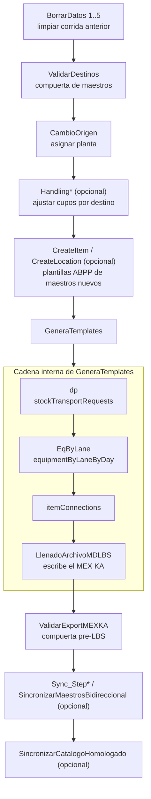

[Volver al índice general](../README.md)

# Macro de ENTRADA — `Planificacion_Plantas_Restos`

Código: [merged/modulo1.vba](../../merged/modulo1.vba) … [merged/modulo7.vba](../../merged/modulo7.vba)
(más [modulo7_legacy.vba](../../merged/modulo7_legacy.vba), la versión anterior del
sincronizador que se conserva como respaldo).

Esta macro vive en el libro `Planificacion_Plantas_Restos_v19.xlsm`. Su trabajo es tomar el
Plan comercial, resolver **desde qué planta** se surte cada renglón y **cómo se arma** cada
tarima, y con eso escribir el archivo `MEX KA PLANTS_Restos_v*.xlsx` que se importa a LBS.

Todo lo que esta macro hace mal se paga después: un carril sin catálogo, un item sin
`ArmadoChep` o un destino sin `Handling` no producen un error inmediato sino un embarque mal
optimizado o un `Order Failure` de LBS. Por eso el paso más importante del pipeline no es
`GeneraTemplates` sino las dos compuertas de validación que lo rodean: `ValidarDestinos`
antes y `ValidarExportMEXKA` después.

## El pipeline

Las llamadas encadenadas dentro de `GeneraTemplates` no son opcionales: `dp` llama a
`EqByLane` al terminar (`merged/modulo1.vba:638-640`), `EqByLane` llama a `itemConnections`
(`merged/modulo1.vba:1729-1731`) y `itemConnections` llama a `LlenadoArchivoMDLBS` salvo que
la bandera `LBS_SkipLlenadoArchivoMDLBS` esté activa (`merged/modulo1.vba:1896-1897`).
Para reconstruir las hojas internas sin tocar el archivo MEX KA se usa
`GeneraTemplatesBuildOnly`, que enciende esa bandera (`merged/modulo1.vba:27-31`).

## Índice de esta carpeta

| Documento | Contenido |
|---|---|
| [01-runbook-operador.md](01-runbook-operador.md) | Orden de los botones, qué revisar después de cada paso, errores comunes y cómo salir de ellos |
| [02-plan-y-parametros.md](02-plan-y-parametros.md) | Mapa de columnas de la hoja `Plan` (A:AF), celdas de configuración de la fila 1, banderas de modo prueba y constantes |
| [03-maestros-y-catalogos.md](03-maestros-y-catalogos.md) | Las hojas de maestros y catálogos: `Handling`, `TarimaPorDestino`, `Logica Origen`, `ArmadoChep`/`ArmadoMadera`, `Catalogo Mode Mix`, `FG14 Destinos`, `User Guide` |
| [04-cambio-origen.md](04-cambio-origen.md) | `CambioOrigen`: cómo se asigna la planta a partir de inventarios, DRP, producción, traspaleo e interplantas |
| [05-generacion-mexka.md](05-generacion-mexka.md) | `dp`, `EqByLane`, `itemConnections` y `LlenadoArchivoMDLBS`: qué hoja del export produce cada uno |
| [06-validaciones-mexka.md](06-validaciones-mexka.md) | Catálogo completo de las validaciones de `ValidarExportMEXKA`, con el mensaje exacto, la causa y el remedio |
| [07-sincronizacion-maestros.md](07-sincronizacion-maestros.md) | `Sync_Step0_DryRun` a `Sync_Step6` y `SincronizarMaestrosBidireccional` |
| [08-catalogo-homologado-tihi.md](08-catalogo-homologado-tihi.md) | `SincronizarCatalogoHomologado` y `AuditarArmadoVsCatalogo`: cómo entra el catálogo TI HI |
| [cadenas/](cadenas/README.md) | Reglas por cadena del lado de entrada, empezando por la tabla de sufijos de item |

## Inventario de macros ejecutables

Todas las entradas públicas del módulo, con su ubicación. Las marcadas como "interna" las
llama otra macro y normalmente no se ejecutan solas.

### Módulo 1 — Generación del export

| Macro | Ubicación | Rol |
|---|---|---|
| `GeneraTemplates` | `merged/modulo1.vba:33` | Botón principal. Muestra las hojas de trabajo y arranca la cadena. |
| `GeneraTemplatesBuildOnly` | `merged/modulo1.vba:27` | Igual pero sin escribir el MEX KA. |
| `dp` | `merged/modulo1.vba:69` | Construye `stockTransportRequests` desde el Plan. |
| `EqByLane` | `merged/modulo1.vba:1179` | Construye `EquipmentByLaneByDay`. |
| `itemConnections` | `merged/modulo1.vba:1736` | Deduplica los items del STR y aplica reglas de cadena. |
| `LlenadoArchivoMDLBS` | `merged/modulo1.vba:2227` | Pega todo en el archivo MEX KA y lo guarda. |

### Módulo 2 — Limpieza y validación de destinos

| Macro | Ubicación | Rol |
|---|---|---|
| `BorrarDatos` | `merged/modulo2.vba:13` | Limpia los datos del `Plan` desde la fila 3. |
| `BorrarDatos2` | `merged/modulo2.vba:21` | Limpia `Handling`. |
| `BorrarDatos3` | `merged/modulo2.vba:29` | Limpia `InventarioPaleteado`. |
| `BorrarDatos4` | `merged/modulo2.vba:37` | Limpia `InventarioDRP`. |
| `BorrarDatos5` | `merged/modulo2.vba:45` | Limpia `ProductSchedule`. |
| `ValidarDestinos` | `merged/modulo2.vba:976` | Compuerta de maestros. Aplica el catálogo a `Handling`, revisa el Plan contra todos los maestros y escribe los hallazgos en `User Guide`. |

### Módulo 3 — Asignación de origen

| Macro | Ubicación | Rol |
|---|---|---|
| `CambioOrigen` | `merged/modulo3.vba:830` | Asigna la planta de origen en `Plan!F` consumiendo inventarios. |
| `SKUhomologo` | `merged/modulo3.vba:1134` | Interna. Sustituye un SKU por su homólogo. |

### Módulo 4 — Cupos de `Handling`

| Macro | Ubicación | Rol |
|---|---|---|
| `HandlingNormal` | `merged/modulo4.vba:1` | Copia los cupos base `L:O` a los cupos activos `P:S`. |
| `HandlingNOFULL` | `merged/modulo4.vba:16` | Anula el Full (`R:S`) de los destinos Mayorista. |
| `HandlingNOSENCILLO` | `merged/modulo4.vba:45` | Anula el Sencillo (`P:Q`) de los destinos Mayorista. |
| `HandlingNOFULLAUTO` | `merged/modulo4.vba:74` | Anula el Full de los destinos Autoservicio. |
| `HandlingNOSENCILLOAUTO` | `merged/modulo4.vba:243` | Anula el Sencillo de los destinos Autoservicio. |
| `HandlingOXXOFullMetro` | `merged/modulo4.vba:106` | Convierte a solo-Full los destinos OXXO del metro. |
| `HandlingFixConnectionOrigins` | `merged/modulo4.vba:216` | Habilita banderas de planta `U:AB` para destinos con conexiones conocidas como problemáticas. |
| `LBS_AplicarCatalogoAHandling` | `merged/modulo4.vba:926` | Interna. Vuelca el `Catalogo Mode Mix` sobre `Handling`. |
| `LBS_AplicarFg14DestinosAMaestros` | `merged/modulo4.vba:1085` | Interna. Siembra `Handling` y `TarimaPorDestino` desde `FG14 Destinos`. |

### Módulo 5 — Plantillas de maestros ABPP

| Macro | Ubicación | Rol |
|---|---|---|
| `CreateItem` | `merged/modulo5.vba:59` | Construye `ItemMaster_ABPP` y exporta `ItemMaster_*.xls`. |
| `CreateLocation` | `merged/modulo5.vba:166` | Construye `SiteMaster_ABPP` y `BodDetail_ABPP` y exporta ambos. |
| `CreaTemplateItemMaster` | `merged/modulo5.vba:148` | Solo la exportación de items. |
| `CreaTemplateSiteMaster` | `merged/modulo5.vba:326` | Solo la exportación de sitios. |
| `CreaTemplateBodDetail` | `merged/modulo5.vba:297` | Solo la exportación de detalle de bodega. |

### Módulo 6 — Validación del export

| Macro | Ubicación | Rol |
|---|---|---|
| `ValidarExportMEXKA` | `merged/modulo6.vba:156` | Compuerta pre-LBS. Corre unas 49 validaciones y escribe `data\mex_ka_validation_report.txt`. |

### Módulo 7 — Sincronizaciones

| Macro | Ubicación | Rol |
|---|---|---|
| `Sync_Step0_DryRun` | `merged/modulo7.vba:145` | Simulación sin escribir nada. |
| `Sync_Step1_PlanDestinosSetup` | `merged/modulo7.vba:150` | Completa `Handling` y `TarimaPorDestino`. |
| `Sync_Step2_PlanItemsSetup` | `merged/modulo7.vba:155` | Completa items y hojas de armado. |
| `Sync_Step3_PlanBodDetailSetup` | `merged/modulo7.vba:160` | Completa `BodDetail`. |
| `Sync_Step4_ExportItems` | `merged/modulo7.vba:165` | Agrega items y packages al MEX KA. |
| `Sync_Step5_ExportConnections` | `merged/modulo7.vba:170` | Agrega carriles a `connections`. |
| `Sync_Step6_ExportEquipments` | `merged/modulo7.vba:175` | Agrega equipos al MEX KA. |
| `SincronizarMaestrosBidireccional` | `merged/modulo7.vba:180` | Corre los siete pasos y después `ValidarExportMEXKA`. |
| `SincronizarCatalogoHomologado` | `merged/modulo7.vba:1510` | Actualiza `ArmadoChep`/`ArmadoMadera`, `Plan!P` y el `itemPackage` del MEX KA desde el catálogo TI HI. |
| `SincronizarCatalogoHomologado_DryRun` | `merged/modulo7.vba:1505` | La misma sincronización en modo simulación. |
| `AuditarArmadoVsCatalogo` | `merged/modulo7.vba:1528` | Auditoría de solo lectura del armado del Plan contra TI HI. |

## Requisito de carpeta local

Varias funciones necesitan escribir reportes en una subcarpeta `data\` junto al libro. Si el
libro está abierto desde una ruta web de SharePoint u OneDrive, esa escritura no es posible:
`LBS_IsWebWorkbookPath` lo detecta y `LBS_MsgWorkbookNeedsLocalFolder` avisa
(`merged/modulo6.vba:140-149`). El respaldo es `%TEMP%\LBS_reports`. Para una corrida normal,
conviene trabajar con el libro sincronizado en disco local.
