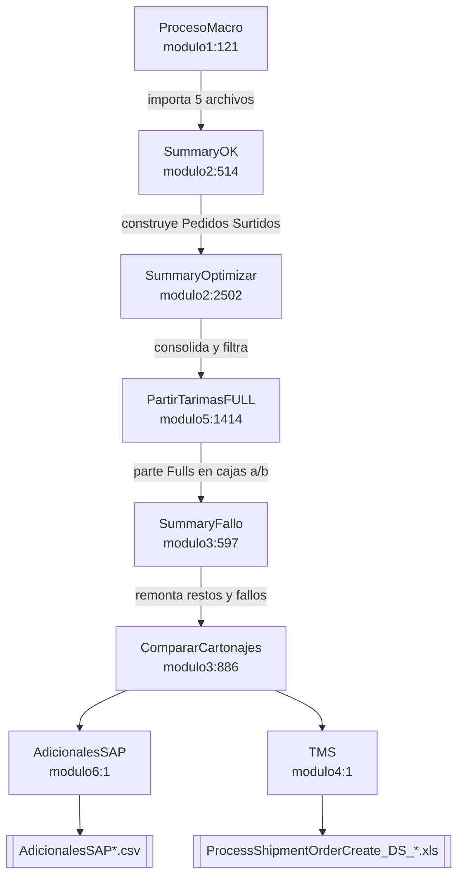

[Volver al índice general](../README.md)

# Macro de SALIDA — `Plantas_Restos_LBS_TO_TMS`

Código: [tms_fg14/modulo1.vba](../../tms_fg14/modulo1.vba) …
[tms_fg14/modulo7.vba](../../tms_fg14/modulo7.vba).

Esta macro vive en el libro `Plantas_Restos_LBS_TO_TMS_v16.xlsm`. Toma los resultados de LBS
—los embarques que el optimizador armó— y los convierte en camiones físicos reales:
decide qué tarima va en qué camión, cómo se apilan los restos, si el camión alcanza el piso
de llenado y qué se queda fuera. Al final emite el archivo para TMS y el CSV para SAP.

Es la macro donde vive prácticamente toda la lógica de negocio por cliente. Solo
[`modulo2.vba`](../../tms_fg14/modulo2.vba) tiene alrededor de 22 500 líneas.

## El pipeline



La secuencia es estrictamente lineal y cada paso depende del anterior. `SummaryOptimizar`
sobre una hoja ya optimizada produce resultados incorrectos, y esa advertencia aparece
incluso en el mensaje de cierre de la sincronización de catálogo de la macro de entrada
(`merged/modulo7.vba:2071`).

## Índice de esta carpeta

| Documento | Contenido |
|---|---|
| [01-runbook-operador.md](01-runbook-operador.md) | El orden de los botones, los diálogos de cada paso, qué revisar y qué hacer cuando algo falla |
| [02-entradas-lbs.md](02-entradas-lbs.md) | Los cinco archivos que importa `ProcesoMacro`: rangos, ordenamientos y filtrados |
| [03-pedidos-surtidos.md](03-pedidos-surtidos.md) | Mapa columna por columna de `Pedidos Surtidos`, de `A` a `AV` |
| [04-motor-armado-cargas.md](04-motor-armado-cargas.md) | Los conceptos transversales del motor: folio, llave de consolidación, cupo, sándwich, charolas, altura y peso |
| [05-eficiencia-y-descartes.md](05-eficiencia-y-descartes.md) | El fill rate `AR`, la hoja `EFICIENCIA POR CADENA`, los gates y los pisos de llenado |
| [06-partir-tarimas-full.md](06-partir-tarimas-full.md) | `PartirTarimasFULL`: cómo se divide un Full en cajas `a` y `b` |
| [07-fallos-y-remonte.md](07-fallos-y-remonte.md) | `SummaryFallo`, `CompararCartonajes` y `LBS_ConsolidarRestos` |
| [08-salidas-tms-y-sap.md](08-salidas-tms-y-sap.md) | La hoja `Data`, el archivo `ProcessShipmentOrderCreate_DS` y el CSV de Adicionales SAP |
| [09-parametros-y-catalogos.md](09-parametros-y-catalogos.md) | Tabla única de todas las constantes, con valor y comentario original, más las hojas de parámetros |
| [10-diagnostico-y-errores.md](10-diagnostico-y-errores.md) | `REVISION MANUAL`, las herramientas de diagnóstico y el modo prueba |
| [cadenas/](cadenas/README.md) | Las reglas por cadena, con la tabla comparativa de cupos, pisos y alturas |

## Macros ejecutables

### El flujo principal

| Macro | Ubicación | Rol |
|---|---|---|
| `ProcesoMacro` | `tms_fg14/modulo1.vba:121` | Importa los cinco archivos de entrada |
| `SummaryOK` | `tms_fg14/modulo2.vba:514` | Construye `Pedidos Surtidos` desde `Shipments` y el resto |
| `SummaryOptimizar` | `tms_fg14/modulo2.vba:2502` | Consolida y aplica los gates de eficiencia |
| `PartirTarimasFULL` | `tms_fg14/modulo5.vba:1414` | Divide los Fulls en cajas `a` y `b` |
| `SummaryFallo` | `tms_fg14/modulo3.vba:597` | Remonta restos y filas fallidas |
| `CompararCartonajes` | `tms_fg14/modulo3.vba:886` | Compara el cartonaje contra el Plan y marca lo no reportado |
| `AdicionalesSAP` | `tms_fg14/modulo6.vba:1` | Prepara los adicionales para SAP |
| `TMS` | `tms_fg14/modulo4.vba:1` | Construye la hoja `Data` y llama a la exportación |

### Auxiliares que se pueden ejecutar por separado

| Macro | Ubicación | Rol |
|---|---|---|
| `FiltrarPorEficiencia` | `tms_fg14/modulo2.vba:4828` | La fase de eficiencia de `SummaryOptimizar`, por separado |
| `ConsolidarNoPlaneados` | `tms_fg14/modulo2.vba:5075` | Intenta subir filas No Planeado a camiones con espacio |
| `CreaTMStemplate` | `tms_fg14/modulo4.vba:57` | Solo la escritura del archivo de TMS |
| `ConsolidarItems` | `tms_fg14/modulo6.vba:108` | Agrupa los items de los adicionales |
| `ExportarACSV` | `tms_fg14/modulo6.vba:152` | Solo la escritura del CSV |

### Diagnóstico y mantenimiento

| Macro | Ubicación | Rol |
|---|---|---|
| `LBS_DiagnosticarConsolidacion` | `tms_fg14/modulo2.vba:22403` | Explica por qué dos filas no se consolidaron |
| `LBS_SeedConsolidaSheet` | `tms_fg14/modulo2.vba:5407` | Siembra la hoja `Consolida` con la tabla por omisión |
| `LBS_SyncTihiSheet` | `tms_fg14/modulo2.vba:8239` | Actualiza la hoja `TI HI` desde SharePoint |
| `LBS_ResetConsMap` | `tms_fg14/modulo2.vba:5256` | Limpia la caché del mapa de consolidación |

Detalle en [10-diagnostico-y-errores.md](10-diagnostico-y-errores.md).

## Las hojas del libro

### Entradas

| Hoja | Origen | Contenido |
|---|---|---|
| `Shipments` | LBS | Los embarques que armó el optimizador. Rango `A:AE` |
| `STP-Equipment Assoc` | LBS | Qué equipo se asignó a cada embarque. Rango `A:W` |
| `STP Failures` | LBS | Los pedidos que LBS no pudo colocar. Rango `A:AE` |
| `Pallet Container Association` | LBS | Cómo quedó armada cada unidad física. Rango `A:AD` |
| `Plan` | Macro de entrada | El mismo Plan comercial. Rango `A:AF` |

### Trabajo y salida

| Hoja | Contenido |
|---|---|
| `Pedidos Surtidos` | **La hoja central.** Una fila por combinación de camión, pedido y SKU. Rango `A:AV` |
| `EFICIENCIA POR CADENA` | Umbral de fill rate por cadena |
| `Data` | El armado del archivo de TMS |
| `AdicionalesSAP` | El armado del CSV de SAP |
| `User Guide` | Los botones y las notas de operación |

### Parámetros y catálogos

| Hoja | Contenido |
|---|---|
| `Catalogo Mode Mix` | El mismo catálogo de carriles que usa la macro de entrada |
| `Cadenas 35 Tarimas` | Lista blanca de cadena + SKU con cupo de 35 |
| `TI HI` | Cajas por cama, camas por tarima, alturas y peso por caja |
| `Consolida` | Mapa de destinatario a grupo de consolidación multi-stop |
| `Equipments` | Maestro de equipos |
| `IDPlantas` | Traducción de códigos de planta |
| `ConsolidaDiag` | Salida del diagnóstico de consolidación |

Detalle en [09-parametros-y-catalogos.md](09-parametros-y-catalogos.md).

## Guardas de tamaño

`tms_fg14/modulo1.vba:1-6` define cuatro límites que existen por razones concretas de Excel:

| Constante | Valor | Comentario original |
|---|---|---|
| `TMS_PLAN_LAST_COL` | `32` | `' Plan TMS: columnas utiles A:AF (32). CC (81) inflaba el rango >65536 celdas -> Overflow (6).` |
| `TMS_COPY_CHUNK_ROWS` | `200` | Filas por bloque de copia |
| `TMS_MAX_IMPORT_ROWS` | `50000` | Tope de filas por hoja importada |
| `TMS_MAX_CELLS_PER_OP` | `60000` | `' Excel: evitar pasar > ~65000 celdas en un solo .Value / .ClearContents` |

El primero documenta un error real: leer el Plan hasta la columna `CC` (81 columnas) hacía
que el rango superara las 65 536 celdas y Excel lanzaba un desbordamiento. Por eso el Plan se
importa solo hasta `AF`.

Los otros tres implementan la misma defensa de forma general.
`TMS_SafeChunkRows` (`tms_fg14/modulo1.vba:41-48`) calcula cuántas filas caben en un bloque
sin pasar de 60 000 celdas, y todas las copias y limpiezas se hacen por bloques
(`TMS_ClearRect` y `TMS_CopyRectValue2`, `tms_fg14/modulo1.vba:50-82`).

`TMS_SheetLastRow` (`tms_fg14/modulo1.vba:17-39`) aborta si una hoja reporta más de 50 000
filas, con un mensaje que sugiere la causa más común:

```
La hoja "<nombre>" reporta N filas (max 50000).
Revise celdas sueltas al final de las columnas clave antes de importar.
```

Casi siempre es una celda con un espacio en la fila 60 000 que hace que `End(xlUp)` devuelva
un número absurdo.

## Protección contra doble clic

`SK_MacroBusy` (`tms_fg14/modulo2.vba:6`) es una bandera que bloquea la re-entrada mientras
una macro larga está corriendo. El comentario explica el problema
(`tms_fg14/modulo2.vba:5-6`):

```
' Blocks re-entrant ribbon clicks while a long macro runs (DoEvents in SK_SetProgress
' otherwise lets a second click re-enter and hard-crash Excel).
```

El motor llama a `DoEvents` periódicamente para actualizar el indicador de progreso, y eso
permite que Excel procese un segundo clic en el botón. Sin la bandera, la macro se reentra a
sí misma y Excel se cierra sin aviso. `LBS_SetMacroBusy`
(`tms_fg14/modulo2.vba:473`) es la que la manipula.

En la práctica: si un botón parece no responder, **no volver a hacer clic**. Ver el progreso
en `Plan!X1`.
