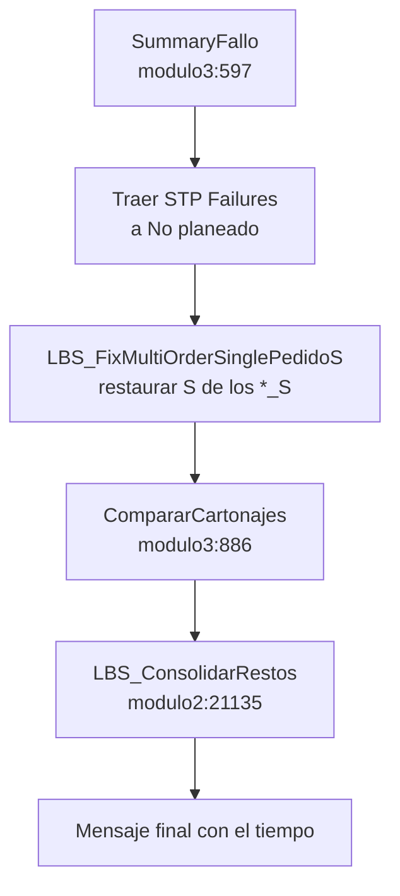

[Volver a la macro de salida](README.md) · [Índice general](../README.md)

# Fallos y remonte

`SummaryFallo` ([tms_fg14/modulo3.vba:597](../../tms_fg14/modulo3.vba)) es el último paso de
armado. Recupera lo que se quedó fuera y lo intenta subir a camiones con espacio.

Hace tres cosas, en este orden:

    10|1. Trae las líneas de `STP Failures` al final de `Pedidos Surtidos`.
2. Llama a `CompararCartonajes`, que detecta cartonaje del Plan que nadie reportó.
3. Llama a `LBS_ConsolidarRestos`, que es el motor de remonte propiamente dicho.



## Paso 1: traer los fallos de LBS

Se recorre `STP Failures` de la fila 2 hacia abajo (`tms_fg14/modulo3.vba:721-793`) y para
cada línea:

- El **pedido** sale de la columna `A` (`Order Id`), cortada en el primer `_`.
- El **material** sale de la columna `E` (`Item Id`), también cortada en el primer `_`. Eso le
  quita el sufijo de cadena.
- La **cantidad** sale de la columna `M` (`Failed Raw Quantity`).
    30|
La llave de cruce con el Plan es `pedido|material` canonizados.

### Tres condiciones para procesar la línea

```vba
If SF_PlanKeyIsDualPlant(dictPlanDual, planKey) Then GoTo NextStpFailure
...
If planRow <= 0 Or sVal <= 0# Then GoTo NextStpFailure
```

    40|1. **No es un pedido de doble planta.** El comentario explica por qué se salta
   (`tms_fg14/modulo3.vba:731`):

```
' Dual-plant: CompararCartonajes por Origen cubre el hueco; no estampar dictPlan.
```

Si el mismo pedido y material se surten desde dos plantas, no se sabe a cuál pertenece el
fallo. Estamparlo en la primera coincidencia del Plan le pondría la planta equivocada.
`CompararCartonajes`, que sí incluye el origen en su llave, lo resuelve después.

    50|2. **El pedido existe en el Plan.** Un fallo de un pedido que no está en el Plan importado no
   se puede reconstruir.
3. **La cantidad fallida es positiva.**

### Merge en lugar de fila nueva

Antes de insertar, se busca si ya existe una fila `No planeado` con la misma llave
(`dictStpPSRow`, `tms_fg14/modulo3.vba:688-710`). Si existe, se **suma** el cartonaje a esa
fila y se recalculan sus tarimas (`tms_fg14/modulo3.vba:745-750`):

```vba
    60|wsPS.Cells(mergeRow, "S").Value = SF_SafeDbl(wsPS.Cells(mergeRow, "S").Value) + sVal
Call SF_RecalcTarimasRow(wsPS, mergeRow)
```

La llave de ese índice incluye el origen cuando está disponible
(`pedido|material|ORIGEN`), y cae a `pedido|material` cuando no
(`tms_fg14/modulo3.vba:700-705`).

### El mapeo del Plan a la fila nueva

Cuando no hay dónde hacer merge, se arma una fila nueva de 37 columnas (`A` a `AK`) copiando
    70|del Plan (`tms_fg14/modulo3.vba:752-789`):

| Col PS | Fuente |
|---|---|
| `A` `G` `K` | `Plan!C` (fecha de orden de compra) |
| `B` | `Plan!A` (tipo de cliente) |
| `H` | `"No planeado"` |
| `I` | `0` |
| `J` | `Format(Now, "ww")` |
| `L` | `Plan!F` (origen) |
| `M` | `Plan!G` (cadena) |
    80|| `N` | `Plan!H` (CEDIS) |
| `O` | `Plan!I` (destinatario) |
| `P` | `Plan!J` (pedido) |
| `Q` | `Plan!K` (cotización SAP) |
| `R` | `Plan!L` (vigencia) |
| `S` | La cantidad fallida |
| `T` `U` | Calculadas con `SF_CalcTarimas` |
| `V` | `Plan!P` (armado) |
| `AA` | El material |
| `AB` `AC` | `Plan!U`, `Plan!V` |
    90|| `AE` | `Plan!W` |
| `AF` | `Plan!Q + "+" + Plan!R + "+" + Plan!S` (los tres tipos de tarima concatenados) |
| `AG` | **`STP Failures!F`, el motivo textual de LBS** |
| `AH` | `Plan!AD` (tipo de tarima) |

Dos observaciones:

- `AG` recibe el motivo de LBS palabra por palabra. Por eso en `Pedidos Surtidos` se leen
  textos en inglés como `Missing required To facility, Invalid Item`.
- `AF` concatena los tres campos heredados `Tipo de tarima1..3` del Plan separados por `+`.
   100|  Es informativo.

Las filas se acumulan en memoria y se descargan de un golpe con `SF_DumpBufferedPSRows`
(`tms_fg14/modulo3.vba:508`), que escribe hasta la columna 37 (`AK`).

### El registro de armado faltante

Si el armado (`Plan!P`) es cero o no numérico, la línea se apunta en `missingArmadoLog` y al
final se escribe un bloque en `STP Failures` (`tms_fg14/modulo3.vba:806-821`):

| Col | Contenido |
   110||---|---|
| `A` | `Pedido` |
| `B` | `Material` |
| `C` | `Cartonaje` |
| `D` | `Armado faltante o invalido en Plan` |

Y el mensaje de cierre cambia de tono:

```
Fallos completado con N linea(s) sin Armado en Plan. Ver STP Failures.
```

   120|Se muestra con icono de advertencia en lugar del informativo. Sin armado no se pueden
calcular tarimas, así que esas líneas quedan con `T = 0` y todo el cartonaje en `U`.

## Paso 2: `CompararCartonajes`

Es la validación más útil de toda la macro. Su comentario de encabezado explica el problema
que resuelve y el error que se corrigió después (`tms_fg14/modulo3.vba:882-885`):

```
' Workaround incidencia BY 18.11 - failures que no salen en Order Failures.
' Baseline = sum Plan AA por pedido|material|Origen; PS suma Programado + No planeado
   130|' del mismo Origen. (Sin Origen en la clave, PC01+PC29 se sumaban y el faltante
' se estampaba en una sola planta -> swap +X/-X en el pivot por Origen.)
```

En resumen: **LBS a veces no reporta un fallo.** Hay cartonaje del Plan que ni salió en
`Shipments` ni en `Order Failures`. Sin esta comparación, ese cartonaje desaparecía sin
dejar rastro.

### Cómo funciona

Tres pasos:
   140|
**Uno.** Se limpian las filas `No reportado por LBS` de la corrida anterior
(`SF_RemoveNoReportadoRows`, `tms_fg14/modulo3.vba:441-458`). Sin esto, cada ejecución
duplicaría los saldos.

**Dos.** Se construye la línea base desde el Plan: la suma de `Plan!AA`
(`Total + BACK ORDER`) agrupada por `pedido|material|ORIGEN`
(`tms_fg14/modulo3.vba:943-964`). Solo entran renglones con cantidad positiva y con origen no
vacío.

   150|**Tres.** Se suma el cartonaje `S` de `Pedidos Surtidos` con la misma llave, contando **tanto
`Programado` como `No planeado`** (`tms_fg14/modulo3.vba:976-996`). Si el Plan pide más de lo
que hay en la hoja, la diferencia se inserta como fila nueva `No planeado`.

La tolerancia es de media caja (`tms_fg14/modulo3.vba:1009`, `1013`):

```vba
If sumaPS + 0.5 >= sumaBase Then GoTo NextCompareKey
...
If diferencia <= 0.5 Then GoTo NextCompareKey
```

   160|### Por qué el origen está en la llave

Es el error que documenta el comentario. Sin el origen, un pedido surtido desde `PC01` y
`PC29` sumaba sus dos cantidades y la diferencia se estampaba en una sola planta. En el pivote
por origen aparecía un `+X` en una planta y un `-X` en la otra. El síntoma clásico de una
llave incompleta.

`SF_CanonOrigen` (`tms_fg14/modulo3.vba:80-89`) normaliza quitando espacios, incluidos los
**espacios duros** (`Chr$(160)`), que es lo que llega al pegar desde una página web.

`SF_CanonPedido` (`tms_fg14/modulo3.vba:291`) hace lo mismo con el pedido, quitando además
   170|las comas de miles y respetando el texto cuando no es numérico.

### Los dos textos de `AG`

| Texto | Cuándo |
|---|---|
| `No reportado por LBS` | El caso normal. La fila lleva `T` y `U` calculados |
| `No reportado por LBS (cartonaje Plan)` | El hueco corresponde a una unidad sándwich |

La distinción viene de `SF_BuildSandwichKeysOnPS` (`tms_fg14/modulo3.vba:460-477`), que
registra las llaves `pedido|material` que aparecen como `LBS_SANDWICH` con `W > 0` en filas
   180|`Programado`.

Cuando el hueco es de una unidad sándwich, la fila se fuerza a `T = 0` y `W = 0`
(`tms_fg14/modulo3.vba:1068-1072`), con todo el cartonaje en `U`:

```vba
' Recalc W/sandwich adjust; preserve T=0 for cartonaje-Plan sandwich gaps.
If InStr(1, CStr(wsPS.Cells(dumpStart + nr, "AG").Value), "cartonaje Plan", vbTextCompare) > 0 Then
    ...
    wsPS.Cells(dumpStart + nr, "T").Value = 0
    wsPS.Cells(dumpStart + nr, "W").Value = 0
```

   190|La razón: el faltante de una unidad sándwich es un resto que se apila, no una tarima nueva.
Dejarle `T > 0` haría que pidiera espacio de tarima propia y el camión se pasaría del cupo.

### Los saldos cuentan para el piso de llenado

Es el punto de conexión con [05-eficiencia-y-descartes.md](05-eficiencia-y-descartes.md). Las
filas `No reportado por LBS` con `T > 0` **se suman al total del folio** al medir el piso, aun
estando en `No planeado`. Ver la sección de saldos pendientes de ese documento.

### La restauración previa de los `*_S`

   200|Justo antes de `CompararCartonajes`, `SummaryFallo` llama a
`LBS_FixMultiOrderSinglePedidoS` (`tms_fg14/modulo3.vba:826-828`), con este comentario:

```
' Restore *_S pedido cartonaje shares before Comparar — otherwise gaps are stamped
' as No reportado, then Fix later leaves Programado+NR double-count.
```

Las unidades `SINGLE` que sirven a varios pedidos se colapsan durante el descarte y pierden
el reparto de cartonaje por pedido. Si se compara en ese estado, aparecen huecos falsos, y al
   210|restaurar el reparto después queda cartonaje contado dos veces: una en `Programado` y otra en
el saldo `No reportado`.

## Paso 3: `LBS_ConsolidarRestos`

Es el motor de remonte (`tms_fg14/modulo2.vba:21135`). Su comentario en el punto de llamada
resume la intención (`tms_fg14/modulo3.vba:834-836`):

```
' LBS - Tras agregar los order failures (No planeado), intentar montarlos sobre un camion
' del mismo grupo (Soriana/City Club, Walmart BA/SC, CHEDRAUI) con cupo, como paridad HEB.
   220|' COMEXTRA: cada confirmacion AD es su camion; cap 40/26 por AD, no merge entre a/b.
```

Es aquí donde se montan los restos descartados, **no** en `SummaryOptimizar`. Ver la sección
correspondiente de [05-eficiencia-y-descartes.md](05-eficiencia-y-descartes.md).

### El patrón de banderas por cadena

Lo primero que hace es escanear qué cadenas hay en la hoja
(`LBS_ScanChainPresence`, `tms_fg14/modulo2.vba:6203`) y guardar el resultado en banderas de
módulo (`tms_fg14/modulo2.vba:118-129`): `mLBS_HasWalmart`, `mLBS_HasChedraui`,
   230|`mLBS_HasLaComer`, `mLBS_HasOxxo`, `mLBS_HasSams`, `mLBS_HasClubCity`, `mLBS_HasComextra`,
`mLBS_HasAlsuper`, `mLBS_HasHeightChain` y `mLBS_HasNoPlaneado`.

Después, cada bloque de la secuencia se ejecuta **solo si su cadena está presente**:

```vba
If mLBS_HasChedraui Then
    Call LBS_SplitChedrauiMixedOriginFolios(ws, lastRow)
    Call LBS_SplitChedrauiOverCapFolios(ws, lastRow)
End If
```

   240|En una corrida de una sola cadena, la mayor parte del código se salta. Es la diferencia entre
minutos y decenas de minutos.

### La secuencia completa

Los mensajes de progreso, en orden (`tms_fg14/modulo2.vba:21152-21270`):

| Progreso en `Plan!X1` | Qué hace |
|---|---|
| `Fallos: TEST ignore Shippable qty is 0` | Solo si `Plan!V1` está activo |
| `Fallos: split mixed origin` | Chedraui: separa folios con origen mixto y sobre cupo |
   250|| `Fallos: split mixed vigencia` | Separa folios que quedaron con vigencias distintas |
| (sin mensaje) | La Comer: separa R/C, recorta sobre cupo, fuerza caja seca |
| (sin mensaje) | Fuerza `Y` de Mode Mix, corrige comentarios de tarima cero, recorta OXXO |
| `Fallos: pack mayorista catalog leftovers` | Sube sobrantes de mayoristas a su cupo de catálogo |
| `Fallos: dedupe folio` | Elimina filas duplicadas de folio + producto |
| `Fallos: prepare TW for cap` | Normaliza `T` y `W` antes de medir cupo |
| `Fallos: unmix SAMS pedidos` | Reagrupa los pedidos cruzados de Sams |
| `Fallos: layer restos metro` | **Apila los restos en las tarimas ancla** |
| `Fallos: open trucks no reportado` | Abre camiones nuevos para los saldos no reportados |
| `Fallos: layer charolas chedraui` | Apilado de charolas de Chedraui |
   260|| `Fallos: layer charolas walmart` | Apilado de charolas de Walmart |
| `Fallos: cap check walmart` | Verifica el cupo después del apilado |
| `Fallos: pack walmart` | Empaqueta Walmart hasta el cupo |
| `Fallos: pack chedraui` / `enforce chedraui` | Lo mismo para Chedraui |
| `Fallos: pack la comer` | Lo mismo para La Comer, con su doble pasada |
| `Fallos: reordenar` | `LBS_ReordenarYCompletar` |
| `Fallos: min fill` | **Vuelve a aplicar el piso de llenado** |
| `Fallos: totales Z = T+W` | Recalcula los totales de tarimas |
| `Fallos: hard trim over cap` | Recorte duro de lo que quedó sobre cupo |
| `Fallos: pack mayorista catalog leftovers post-trim` | Segunda pasada de mayoristas |
   270|| `Fallos: remount cupo peels post-trim` | Remonta lo que el recorte descargó |

### Tres cosas que vale la pena notar

**El piso de llenado se vuelve a aplicar.** `LBS_EnforceWalmartMinFill` corre otra vez aquí.
Un camión que pasó el piso en `SummaryOptimizar` puede caer en `SummaryFallo` si el remonte
lo alteró, y al revés: un camión descartado puede recuperarse si el remonte le sube carga.

**`LBS_ResetConsMap` se llama al entrar** (`tms_fg14/modulo2.vba:21142`). Es la única fase que
relee la hoja `Consolida`, así que un cambio en esa hoja sí surte efecto entre
`SummaryOptimizar` y `SummaryFallo`.
   280|
**El recorte va antes del remonte final.** El orden es recortar lo que sobra y después volver
a montar lo recortado en otros camiones. Suena redundante pero no lo es: el recorte libera
espacio en un camión y el remonte busca camiones con espacio, así que la segunda pasada
puede colocar en otro folio lo que el primero descargó.

## `ConsolidarNoPlaneados`

Es una macro aparte (`tms_fg14/modulo2.vba:5075`), llamada desde `FiltrarPorEficiencia` pero
también ejecutable sola. Su comentario original la fecha
(`tms_fg14/modulo2.vba:5073-5074`):
   290|
```
' Requerimiento 05/12 - consolidar los no planeados después de desmontarlos por baja eficiencia
```

Intenta subir filas `No planeado` a camiones con espacio, después de que el gate de eficiencia
las desmontó.

## El mensaje final y el tiempo

   300|`SummaryFallo` mide su duración con `Timer` y la reporta
(`tms_fg14/modulo3.vba:839-856`):

```
Proceso completado correctamente.

Fallos: 3.2 min
```

El cálculo maneja el cruce de medianoche (`If elapsedSec < 0 Then elapsedSec = elapsedSec +
86400#`), y cambia de segundos a minutos al pasar del minuto.
   310|
Las tres variantes del mensaje:

| Situación | Mensaje | Icono |
|---|---|---|
| Todo bien | `Proceso completado correctamente.` | Información |
| Faltó armado | `Fallos completado con N linea(s) sin Armado en Plan. Ver STP Failures.` | Advertencia |
| Modo prueba activo | Se agrega `TEST MODE (Plan!V1): se ignoro 'Shippable qty is 0' al remountar.` | El que corresponda |

La tercera línea es la que hay que buscar si los resultados salen mejores de lo esperado: el
modo prueba está encendido.
   320|
## Qué revisar después

| Dónde | Qué buscar |
|---|---|
| `AG` = `No reportado por LBS` | Cartonaje del Plan que LBS no colocó. Si son muchos, revisar el export MEX KA |
| `AG` con texto en inglés | Motivos que vinieron de `STP Failures!F` |
| `STP Failures` | El bloque `Armado faltante o invalido en Plan` al final |
| `AV` | Banderas nuevas de tarimas y peso, del recorte y el remonte |
| `H` = `No planeado` al final de la hoja | Lo que no se pudo remontar |

   330|El fixture [tms_fg14/noreportado.tsv](../../tms_fg14/noreportado.tsv) es un caso real de esta
fase.

## La guarda de re-entrada

`SummaryFallo` sí usa `LBS_IsMacroBusy` (`tms_fg14/modulo3.vba:647-652`):

```
Ya hay una macro LBS en ejecucion. Espera a que termine (mira Plan!X / barra de estado).
```

   340|A diferencia de `PartirTarimasFULL`, aquí un doble clic está protegido.
