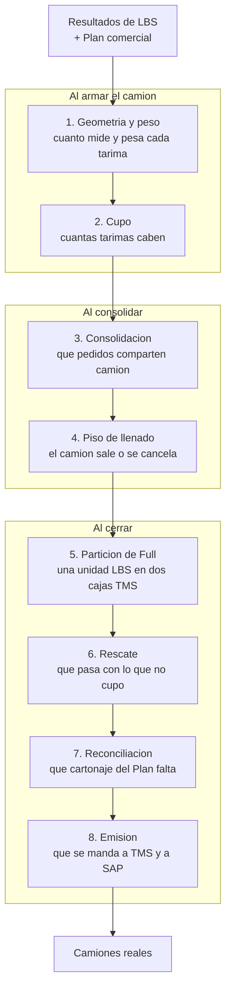
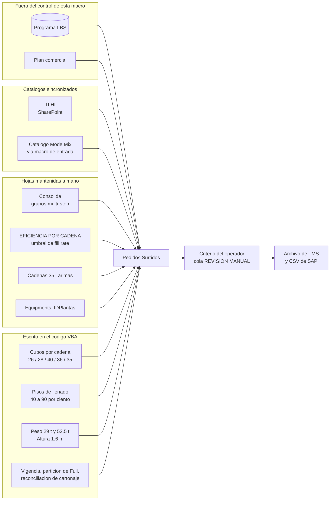
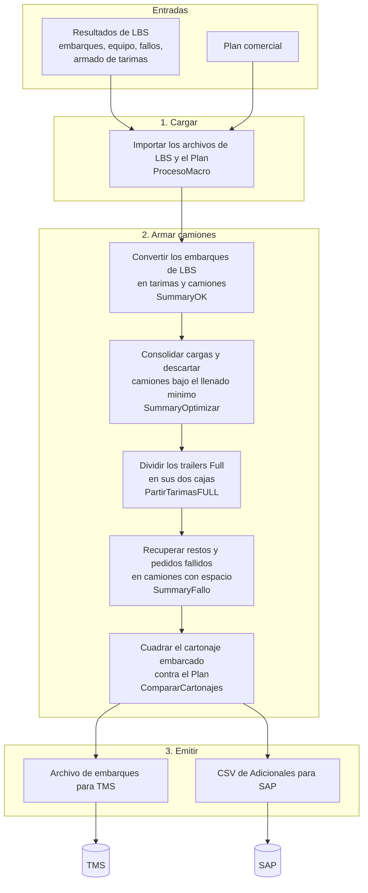

[Volver al índice general](../README.md)

# Macro de SALIDA — `Plantas_Restos_LBS_TO_TMS`

Código: [tms_fg14/modulo1.vba](../../tms_fg14/modulo1.vba) …
[tms_fg14/modulo7.vba](../../tms_fg14/modulo7.vba).

Esta macro vive en el libro `Plantas_Restos_LBS_TO_TMS_v16.xlsm`. Toma los resultados de LBS
—los embarques que el optimizador armó— y los convierte en camiones físicos reales:
decide qué tarima va en qué camión, cómo se apilan los restos, si el camión alcanza el piso
de llenado y qué se queda fuera. Al final emite el archivo para TMS y el CSV para SAP.

Es la macro donde vive prácticamente toda la lógica de negocio por cliente. Solo
[`modulo2.vba`](../../tms_fg14/modulo2.vba) tiene alrededor de 22 500 líneas.

Este documento tiene dos partes. La primera está escrita para el comité: qué decide esta
macro, dónde vive cada regla hoy y quién la cambia. La segunda es la referencia técnica de
siempre. Los términos del negocio están en el [glosario](../glosario.md).

## Para el comité: qué decide esta macro

LBS entrega un resultado de optimización. Esta macro lo convierte en camiones que
realmente salen: decide **cuántas tarimas caben**, **qué pedidos viajan juntos**, **si un
camión sale o se cancela por ir mal llenado**, **qué se hace con lo que no cupo** y **qué
cartonaje del Plan nunca llegó a reportarse**. Ninguna de esas decisiones la toma una
persona durante la corrida: están escritas en el código o en las hojas del libro.

La pregunta que este documento busca responder es de propiedad, no de tecnología: cada una
de esas reglas puede vivir en el programa LBS, en el criterio del equipo de planeación, o
en los datos maestros comerciales. Hoy conviven las tres cosas dentro de un archivo de
Excel.

La escala, medida sobre el código:

| Medida | Valor |
|---|---|
| Líneas de VBA en los 7 módulos | ~26 000, de las cuales `modulo2.vba` concentra 22 500 (86 %) |
| Procedimientos | 475 |
| Procedimientos que ramifican por nombre de cadena | **247 (52 %)** |
| Constantes de negocio escritas en el código | **33** (29 en `modulo2.vba:10-83`, 4 en `modulo5.vba`) |
| Cadenas o familias con reglas propias | 12 |
| Hojas de Excel que funcionan como base de datos | 17 |
| Diálogos donde la macro pregunta algo al operador | 5 selectores de archivo, ningún Sí/No |

Dos cifras merecen lectura conjunta. **Más de la mitad de los procedimientos preguntan de
qué cadena es la fila** antes de decidir: la lógica por cliente no está aislada en un
módulo, está repartida por todo el motor. Y **33 valores de negocio solo se pueden cambiar
editando y reimportando código VBA**: un cupo negociado con una cadena no se ajusta en una
celda.

## Las ocho decisiones de negocio

Los botones que ve el operador no son las decisiones. Estas son:



| # | Decisión | Qué determina en la práctica | De qué dato depende | Dónde vive la regla hoy |
|---|---|---|---|---|
| 1 | Geometría y peso | La altura y el peso de cada tarima, y por lo tanto si el camión excede el tope | Catálogo `TI HI` por cadena y material | Catálogo sincronizado, más topes en código |
| 2 | Cupo | Cuántas tarimas se aceptan por camión antes de mandar el resto a `No planeado` | Cadena, tipo de equipo, carril, SKU | Constantes en código, más `Catalogo Mode Mix` |
| 3 | Consolidación | Qué destinatarios viajan en el mismo camión multi-stop | Hoja `Consolida`, origen y vigencia del Plan | Hoja del libro, con respaldo en código |
| 4 | Piso de llenado | Si un camión que LBS armó se cancela por ir bajo | Porcentaje por cadena sobre el cupo | Constantes en código |
| 5 | Partición de Full | Cómo se divide un Full en las cajas `a` y `b` que TMS exige | Cupo de caja y sufijo de camión | Constantes en código |
| 6 | Rescate | Si lo descartado o fallido se monta en otro camión con espacio | Cupo del grupo y cadena | Código |
| 7 | Reconciliación | Qué cartonaje del Plan no salió ni en embarques ni en fallos | Plan contra `Pedidos Surtidos` | Código |
| 8 | Emisión | Qué se escribe en el archivo de TMS y en el CSV de SAP | `Pedidos Surtidos` en estado final | Código |

## Dónde vive cada regla hoy

Toda regla del proceso está en uno de estos cinco lugares. La diferencia importa porque
determina **a quién hay que pedirle el cambio** y **cuánto tarda**.

| Lugar | Cómo se cambia | Quién puede hacerlo hoy |
|---|---|---|
| **Constante en el código VBA** | Editar el módulo y reimportarlo al `.xlsm` | Solo quien mantiene el código |
| **Hoja del libro mantenida a mano** | Escribir en una celda | El planeador, sin intermediarios |
| **Catálogo sincronizado desde fuera** | Actualizar el origen y correr el botón de sincronización | Datos maestros, con un paso operativo |
| **Dato que viene de LBS** | No se cambia aquí: se cambia en LBS o en el Plan | Fuera de esta macro |
| **Criterio del operador** | Se decide en cada corrida, mirando la hoja | Quien corre la macro |

Las tablas que siguen son el inventario. La última columna queda vacía a propósito: es la
que llena el comité.

### Cupos (tarimas por camión)

| Regla | Valor hoy | Dónde vive | Quién lo cambia | Frecuencia de cambio | Evidencia | Destino (a definir) |
|---|---|---|---|---|---|---|
| Cupo sencillo general | 26 | Constante VBA | Código | Casi nunca | `modulo2.vba:19` | |
| Cupo Walmart sencillo | 28 | Constante VBA | Código | Por acuerdo con la cadena | `modulo2.vba:21` | |
| Cupo Full general | 40 | Constante VBA | Código | Casi nunca | `modulo2.vba:25` | |
| Cupo de caja `a` / `b` | 20 | Constante VBA | Código | Casi nunca | `modulo2.vba:29` | |
| Cupo OXXO sencillo por equipo | 24 general, 22 en `Z4290_OXX`, 28 en MTY | Constante VBA | Código | Por acuerdo fechado 29/07/2026 | `modulo2.vba:35-37` | |
| Tope de embarque OXXO Full | 36 | Constante VBA | Código | Por cambio de equipo | `modulo2.vba:32` | |
| Destinatario que activa el cupo 28 de MTY | `400101621` | Constante VBA | Código | Por apertura o cierre de CEDIS | `modulo2.vba:38` | |
| Cupo Cap35 por SKU | 35 | Constante VBA **y** hoja | Código y planeación | Por SKU y temporada | `modulo2.vba:40` + hoja `Cadenas 35 Tarimas` | |
| Full de mayorista en camión único | 36 | Constante VBA | Código | Casi nunca | `modulo2.vba:43` | |
| Cupo por carril | Una fila por carril | Catálogo sincronizado | Datos maestros | Continuo | `Catalogo Mode Mix`, columna `Pallets Max` | |

El comentario del código deja registrada la negociación detrás de los cupos de OXXO
(`modulo2.vba:33-34`):

```
' OXXO Sencillo from equipment Max Pallet Count (client 29/07/2026):
' Z5290_OXX=24 (not catalog S/26 / generic Z5290), Z4290_OXX=22, Z5290_OXX_MTY=28.
```

Es un acuerdo con fecha, guardado como línea de código.

### Pisos de llenado y umbrales de eficiencia

Son dos cosas distintas que el código separa explícitamente (`modulo2.vba:61-64`): el
porcentaje de la hoja `EFICIENCIA POR CADENA` filtra el fill rate del **pedido**, mientras
que el piso de llenado cancela el **camión** por número de tarimas.

| Regla | Valor hoy | Dónde vive | Quién lo cambia | Frecuencia de cambio | Evidencia | Destino (a definir) |
|---|---|---|---|---|---|---|
| Piso Walmart | 40 % (12 de 28) | Constante VBA | Código | Por política de despacho | `modulo2.vba:65` | |
| Piso Soriana / City Club | 70 % (19 de 26) | Constante VBA | Código | Por política de despacho | `modulo2.vba:67` | |
| Piso OXXO | 90 % (33 de 36) | Constante VBA | Código | Por política de despacho | `modulo2.vba:69` | |
| Piso Comextra | 90 % | Constante VBA | Código | Por política de despacho | `modulo2.vba:73` | |
| Piso La Comer | 80 % (21 de 26) | Constante VBA | Código | Por política de despacho | `modulo2.vba:78` | |
| Piso Chedraui | 80 % (21 de 26) | Constante VBA | Código | Por política de despacho | `modulo2.vba:81` | |
| Rescate de grupo Walmart | 50 % | Constante VBA | Código | Rara vez | `modulo2.vba:60` | |
| Rescate de pedido Chedraui | 80 % | Constante VBA | Código | Rara vez | `modulo2.vba:56` | |
| Umbral de fill rate por cadena | Una fila por cadena | Hoja del libro | Planeación | Por corrida si hace falta | Hoja `EFICIENCIA POR CADENA` | |
| Umbral por omisión cuando la cadena no está en la hoja | 90 | Constante en código | Código | Nunca se ha cambiado | `modulo2.vba:2613` | |

Vale la pena notar el contraste de la última pareja: el planeador puede ajustar el umbral
de cualquier cadena escribiendo en una celda, pero **el valor que aplica cuando la cadena
no aparece en la hoja está quemado en el código**. Además la hoja solo se lee hasta la fila
500 (`modulo2.vba:2591`).

### Límites físicos

| Regla | Valor hoy | Dónde vive | Quién lo cambia | Frecuencia de cambio | Evidencia | Destino (a definir) |
|---|---|---|---|---|---|---|
| Peso máximo de camión | 29 t | Constante VBA, escrita dos veces | Código | Por normativa o equipo | `modulo2.vba:10` y `modulo5.vba:2` | |
| Peso máximo de Full en autoservicio | 52.5 t | Constante VBA | Código | Por normativa o equipo | `modulo2.vba:12` | |
| Tara de tarima | 30 kg las tres variantes | Constante VBA | Código | Pendiente de ficha técnica | `modulo2.vba:15-17` | |
| Altura máxima Walmart | 1.6 m | Constante VBA | Código | Por especificación de cliente | `modulo2.vba:23` | |
| Altura máxima La Comer | 1.6 m | Constante VBA | Código | Provisional | `modulo2.vba:83` | |
| TI, HI, alto de caja, altura de armado, peso por caja | Una fila por cadena y material | Catálogo SharePoint sincronizado a la hoja `TI HI` | Datos maestros | Continuo | `LBS_SyncTihiSheet` (`modulo2.vba:8229`) | |

Dos de estas filas llevan una advertencia escrita por quien programó:

- Las tres taras de tarima valen 30 kg con el comentario `' TODO tech specs` en Chep,
  plástica y madera (`modulo2.vba:15-17`). Es un valor puesto a falta del dato real.
- La altura de La Comer está marcada como `' trial = Walmart 1.6 m` (`modulo2.vba:82`).
  No es una especificación de esa cadena: es la de Walmart copiada en lo que llega la suya.

### Consolidación

| Regla | Valor hoy | Dónde vive | Quién lo cambia | Frecuencia de cambio | Evidencia | Destino (a definir) |
|---|---|---|---|---|---|---|
| Mapa de destinatario a grupo multi-stop | ~47 destinatarios en 12 grupos | Hoja `Consolida`, con tabla por omisión en el código | Planeación, si la hoja existe | Por cambio de ruta | Hoja `Consolida`; respaldo en `modulo2.vba:5344-5392` | |
| Nunca mezclar dos vigencias en un camión | Regla dura, sin excepción por cadena | Código | Código | No se ha cambiado | `modulo2.vba:5451` | |
| Separación `R` / `C` de La Comer | Cuarto componente de la llave | Código | Código | No se ha cambiado | `modulo2.vba:5453` | |
| Destinatario no listado | Viaja solo, en grupo propio | Código | Código | No se ha cambiado | `modulo2.vba:5212` | |

La hoja `Consolida` es el caso más claro de una regla que ya fue entregada a planeación. El
comentario de `LBS_SeedConsolidaSheet` lo dice con todas sus letras (`modulo2.vba:5395-5396`):

```
' LBS - Crea (o reescribe) la hoja "Consolida" con la tabla por defecto, para que el
' planeador la mantenga sin tocar codigo. Ejecutar una vez; despues editar la hoja.
```

### Datos que la macro no decide

Estos entran ya resueltos y la macro los consume. Cambiarlos significa cambiar LBS o el
Plan, no esta macro.

| Dato | Origen | Qué determina |
|---|---|---|
| Fill rate del pedido (`AR`) | `Shipments!L` | Alimenta el gate de eficiencia; se borra al terminar |
| Equipo asignado al embarque | `STP-Equipment Assoc` | De él dependen varios cupos |
| Pedidos que LBS no pudo colocar | `STP Failures` | Entran como `No planeado` con el motivo de LBS |
| Armado físico de cada unidad | `Pallet Container Association` | Base del conteo de tarimas |
| Vigencia y cartonaje comprometido | `Plan` | Regla de consolidación y reconciliación final |

### Tres casos donde el mismo dato se mantiene en dos lugares

No son opiniones sobre el diseño, son hechos que cambian la respuesta a "¿a quién le pido
el cambio?".

1. **La lista blanca de mayoristas Cap35 está escrita dos veces en código**, en
   `modulo2.vba:5268` y en `modulo5.vba:540`, con las mismas cinco cadenas. Agregar una
   cadena a la hoja `Cadenas 35 Tarimas` **no surte efecto** si no se editan también los dos
   módulos: la hoja se filtra contra esa lista antes de leerse (`modulo2.vba:5314`).
2. **El tope de peso de 29 t existe en dos constantes independientes**, `modulo2.vba:10` y
   `modulo5.vba:2`. Cambiar una y no la otra deja el proceso inconsistente entre el armado
   y la partición de Fulls.
3. **`Catalogo Mode Mix` trae una columna `Peso Max` que la macro de salida no lee.** El
   cupo sí sale del catálogo; el peso sale de las constantes. Hay un dato maestro publicado
   que el proceso ignora.

## Qué hace esta macro sobre lo que LBS ya entregó

Este es el punto más relevante para decidir qué puede regresar al programa LBS. La macro no
solo traduce el resultado del optimizador: en varios puntos lo rehace. En todos los casos
el motivo quedó escrito en el propio código.

| Qué hace la macro | Procedimiento | Motivo registrado en el código |
|---|---|---|
| Une en un camión embarques que LBS dejó separados | `LBS_MergeMetroProgramado` (`modulo2.vba:17718`) | Los folios chicos del mismo grupo quedaban como camiones separados aunque cupieran juntos |
| Cancela camiones que LBS armó, por ir bajo el piso | `LBS_EnforceWalmartMinFill` (`modulo2.vba:4431`) | Se marcan `Descartado: bajo llenado post-consolidacion` y se limpian las columnas de camión (`modulo2.vba:4551-4569`) |
| Recalcula la altura en lugar de usar la de LBS | `LBS_RecalcWalmartHeightsAOAP` (`modulo2.vba:9107`) | `' TI HI first for Walmart/La Comer sandwich/restos (PCA leftovers inflate partial layers).` (`modulo2.vba:9490`) |
| Parte un embarque Full en dos cajas | `PartirTarimasFULL` (`modulo5.vba:1414`) | LBS entrega una sola unidad; TMS necesita dos con sufijo `a` y `b` |
| Reconstruye cartonaje que LBS nunca reportó | `CompararCartonajes` (`modulo3.vba:886`) | `' Workaround incidencia BY 18.11 - failures que no salen en Order Failures.` (`modulo3.vba:882`) |
| Impide que dos vigencias compartan camión | `LBS_ConsolidaKey` (`modulo2.vba:5453`) | `' Hard rule: never mix distinct Plan vigencias on one truck.` (`modulo2.vba:5451`) |
| Vuelve a montar restos y fallos sobre camiones con espacio | `LBS_ConsolidarRestos` (`modulo2.vba:21125`) | Paridad con el manejo de HEB: lo descartado sube a un camión del mismo grupo con cupo |

Puestos juntos, estos casos se dividen en tres situaciones distintas, y la distinción
importa para la decisión del comité:

- **Reglas que LBS no conoce**: el mapa `Consolida`, la vigencia del Plan y la marca `R`/`C`
  de La Comer no viajan en el modelo de embarque de LBS.
- **Reglas que LBS podría aplicar pero no aplica**: los pisos de llenado y los cupos por
  cadena son restricciones expresables como objetivo de optimización.
- **Compensación de huecos de LBS**: la reconciliación de cartonaje existe porque el
  optimizador a veces no reporta un fallo, y la altura se recalcula porque el valor de LBS
  describe la capa completa, no el resto de media capa.

Entre una cuarta y una tercera parte del código de `modulo2.vba` y `modulo3.vba` existe
para tratar fallos, restos y reconciliación contra el Plan. Es decir: **buena parte de esta
macro no arma camiones, repara la salida del optimizador.**

## Dónde interviene una persona

Conviene corregir una impresión común. Durante la corrida, la macro casi no pregunta nada:
no hay ni un solo `InputBox` ni un solo diálogo de Sí/No en los siete módulos. Lo único que
la detiene son **cinco selectores de archivo** en `ProcesoMacro` y unos 26 mensajes
informativos de un solo botón.

El juicio humano está concentrado **después** de cada paso, y se ejerce leyendo tres
columnas de `Pedidos Surtidos`:

| Columna | Qué contiene | Qué decide la persona |
|---|---|---|
| `AV` | La cola `REVISION MANUAL`: sobrepeso, exceso de altura, sobre cupo, bajo cupo | Si el camión sale así, se parte a mano, o se corrige el catálogo |
| `AG` | El motivo por el que una fila quedó en `No planeado` | Si se acepta la pérdida, se remonta, o se corrige el Plan |
| `AR` | El fill rate que vino de LBS | Si el umbral de esa cadena está bien calibrado |

Las decisiones recurrentes que hoy toma quien opera, sin que estén escritas en ningún lado
como política:

- Aceptar un camión subutilizado, o esperar más carga.
- Partir a mano un camión que excede las 29 toneladas.
- Aceptar o escalar el cartonaje que el Plan comprometió y nunca se embarcó.
- Ajustar la hoja `Consolida` y volver a correr desde `SummaryOK`.
- Confirmar que `Plan!V1` está apagado, porque el modo prueba permite montar carga sin
  inventario y una corrida así no sirve para producción.

Detalle operativo en [01-runbook-operador.md](01-runbook-operador.md) y
[10-diagnostico-y-errores.md](10-diagnostico-y-errores.md).

## Criterios para clasificar cada regla

Cinco preguntas para aplicar a cada fila del inventario. No traen respuesta sugerida.

1. **¿Qué tipo de regla es?** Una restricción física del equipo, un acuerdo comercial con la
   cadena, o una política operativa de despacho. Las tres suelen tener dueños distintos.
2. **¿Quién es hoy el dueño de la verdad de ese dato, aunque no sea quien lo mantiene en
   esta macro?** Los cupos de OXXO salen del `Max Pallet Count` del equipo; el peso por caja
   sale del catálogo de producto.
3. **¿Con qué frecuencia cambia?** Por contrato, por temporada, por corrida. Lo que cambia
   seguido no debería requerir reimportar un módulo de VBA.
4. **¿LBS recibe hoy ese dato en el archivo de importación?** Si no lo recibe, moverle la
   regla implica primero ampliar el archivo de entrada.
5. **¿Qué pasa el día que cambia y nadie actualiza la macro?** Un camión mal armado, un
   embarque rechazado en el andén, o nada visible hasta el cierre de mes.

## Mapa de origen actual

De dónde nace hoy cada grupo de reglas, antes de cualquier decisión del comité.



Las cuatro cajas del bloque de código son las que hoy no tienen dueño fuera del
mantenimiento del VBA. Son también las que concentran los acuerdos comerciales por cadena.

---

## Referencia técnica

De aquí en adelante es la documentación técnica del proceso: el pipeline paso a paso, el
índice de la carpeta, las macros ejecutables, las hojas del libro y las guardas de tamaño.

## El pipeline

Cada caja es un botón que se ejecuta en orden. El título describe la decisión de negocio que
toma ese paso; el nombre de la macro va debajo como referencia para el operador.



La secuencia es estrictamente lineal y cada paso depende del anterior. `SummaryOptimizar`
sobre una hoja ya optimizada produce resultados incorrectos, y esa advertencia aparece
incluso en el mensaje de cierre de la sincronización de catálogo de la macro de entrada
(`merged/modulo7.vba:2071`).

## Índice de esta carpeta

| Documento | Contenido |
|---|---|
| [01-runbook-operador.md](01-runbook-operador.md) | El orden de los botones, los diálogos de cada paso, qué revisar y qué hacer cuando algo falla |
| [02-entradas-lbs.md](02-entradas-lbs.md) | Los cinco archivos que importa `ProcesoMacro`: rangos, ordenamientos y filtrados |
| [03-pedidos-surtidos.md](03-pedidos-surtidos.md) | Mapa columna por columna de `Pedidos Surtidos`, de `A` a `AV` |
| [04-motor-armado-cargas.md](04-motor-armado-cargas.md) | Los conceptos transversales del motor: folio, llave de consolidación, cupo, sándwich, charolas, altura y peso |
| [05-eficiencia-y-descartes.md](05-eficiencia-y-descartes.md) | El fill rate `AR`, la hoja `EFICIENCIA POR CADENA`, los gates y los pisos de llenado |
| [06-partir-tarimas-full.md](06-partir-tarimas-full.md) | `PartirTarimasFULL`: cómo se divide un Full en cajas `a` y `b` |
| [07-fallos-y-remonte.md](07-fallos-y-remonte.md) | `SummaryFallo`, `CompararCartonajes` y `LBS_ConsolidarRestos` |
| [08-salidas-tms-y-sap.md](08-salidas-tms-y-sap.md) | La hoja `Data`, el archivo `ProcessShipmentOrderCreate_DS` y el CSV de Adicionales SAP |
| [09-parametros-y-catalogos.md](09-parametros-y-catalogos.md) | Tabla única de todas las constantes, con valor y comentario original, más las hojas de parámetros |
| [10-diagnostico-y-errores.md](10-diagnostico-y-errores.md) | `REVISION MANUAL`, las herramientas de diagnóstico y el modo prueba |
| [cadenas/](cadenas/README.md) | Las reglas por cadena, con la tabla comparativa de cupos, pisos y alturas |

## Macros ejecutables

### El flujo principal

| Macro | Ubicación | Rol |
|---|---|---|
| `ProcesoMacro` | `tms_fg14/modulo1.vba:121` | Importa los cinco archivos de entrada |
| `SummaryOK` | `tms_fg14/modulo2.vba:514` | Construye `Pedidos Surtidos` desde `Shipments` y el resto |
| `SummaryOptimizar` | `tms_fg14/modulo2.vba:2502` | Consolida y aplica los gates de eficiencia |
| `PartirTarimasFULL` | `tms_fg14/modulo5.vba:1414` | Divide los Fulls en cajas `a` y `b` |
| `SummaryFallo` | `tms_fg14/modulo3.vba:597` | Remonta restos y filas fallidas |
| `CompararCartonajes` | `tms_fg14/modulo3.vba:886` | Compara el cartonaje contra el Plan y marca lo no reportado |
| `AdicionalesSAP` | `tms_fg14/modulo6.vba:1` | Prepara los adicionales para SAP |
| `TMS` | `tms_fg14/modulo4.vba:1` | Construye la hoja `Data` y llama a la exportación |

### Auxiliares que se pueden ejecutar por separado

| Macro | Ubicación | Rol |
|---|---|---|
| `FiltrarPorEficiencia` | `tms_fg14/modulo2.vba:4828` | La fase de eficiencia de `SummaryOptimizar`, por separado |
| `ConsolidarNoPlaneados` | `tms_fg14/modulo2.vba:5075` | Intenta subir filas No Planeado a camiones con espacio |
| `CreaTMStemplate` | `tms_fg14/modulo4.vba:57` | Solo la escritura del archivo de TMS |
| `ConsolidarItems` | `tms_fg14/modulo6.vba:108` | Agrupa los items de los adicionales |
| `ExportarACSV` | `tms_fg14/modulo6.vba:152` | Solo la escritura del CSV |

### Diagnóstico y mantenimiento

| Macro | Ubicación | Rol |
|---|---|---|
| `LBS_DiagnosticarConsolidacion` | `tms_fg14/modulo2.vba:22403` | Explica por qué dos filas no se consolidaron |
| `LBS_SeedConsolidaSheet` | `tms_fg14/modulo2.vba:5407` | Siembra la hoja `Consolida` con la tabla por omisión |
| `LBS_SyncTihiSheet` | `tms_fg14/modulo2.vba:8239` | Actualiza la hoja `TI HI` desde SharePoint |
| `LBS_ResetConsMap` | `tms_fg14/modulo2.vba:5256` | Limpia la caché del mapa de consolidación |

Detalle en [10-diagnostico-y-errores.md](10-diagnostico-y-errores.md).

## Las hojas del libro

### Entradas

| Hoja | Origen | Contenido |
|---|---|---|
| `Shipments` | LBS | Los embarques que armó el optimizador. Rango `A:AE` |
| `STP-Equipment Assoc` | LBS | Qué equipo se asignó a cada embarque. Rango `A:W` |
| `STP Failures` | LBS | Los pedidos que LBS no pudo colocar. Rango `A:AE` |
| `Pallet Container Association` | LBS | Cómo quedó armada cada unidad física. Rango `A:AD` |
| `Plan` | Macro de entrada | El mismo Plan comercial. Rango `A:AF` |

### Trabajo y salida

| Hoja | Contenido |
|---|---|
| `Pedidos Surtidos` | **La hoja central.** Una fila por combinación de camión, pedido y SKU. Rango `A:AV` |
| `EFICIENCIA POR CADENA` | Umbral de fill rate por cadena |
| `Data` | El armado del archivo de TMS |
| `AdicionalesSAP` | El armado del CSV de SAP |
| `User Guide` | Los botones y las notas de operación |

### Parámetros y catálogos

| Hoja | Contenido |
|---|---|
| `Catalogo Mode Mix` | El mismo catálogo de carriles que usa la macro de entrada |
| `Cadenas 35 Tarimas` | Lista blanca de cadena + SKU con cupo de 35 |
| `TI HI` | Cajas por cama, camas por tarima, alturas y peso por caja |
| `Consolida` | Mapa de destinatario a grupo de consolidación multi-stop |
| `Equipments` | Maestro de equipos |
| `IDPlantas` | Traducción de códigos de planta |
| `ConsolidaDiag` | Salida del diagnóstico de consolidación |

Detalle en [09-parametros-y-catalogos.md](09-parametros-y-catalogos.md).

## Guardas de tamaño

`tms_fg14/modulo1.vba:1-6` define cuatro límites que existen por razones concretas de Excel:

| Constante | Valor | Comentario original |
|---|---|---|
| `TMS_PLAN_LAST_COL` | `32` | `' Plan TMS: columnas utiles A:AF (32). CC (81) inflaba el rango >65536 celdas -> Overflow (6).` |
| `TMS_COPY_CHUNK_ROWS` | `200` | Filas por bloque de copia |
| `TMS_MAX_IMPORT_ROWS` | `50000` | Tope de filas por hoja importada |
| `TMS_MAX_CELLS_PER_OP` | `60000` | `' Excel: evitar pasar > ~65000 celdas en un solo .Value / .ClearContents` |

El primero documenta un error real: leer el Plan hasta la columna `CC` (81 columnas) hacía
que el rango superara las 65 536 celdas y Excel lanzaba un desbordamiento. Por eso el Plan se
importa solo hasta `AF`.

Los otros tres implementan la misma defensa de forma general.
`TMS_SafeChunkRows` (`tms_fg14/modulo1.vba:41-48`) calcula cuántas filas caben en un bloque
sin pasar de 60 000 celdas, y todas las copias y limpiezas se hacen por bloques
(`TMS_ClearRect` y `TMS_CopyRectValue2`, `tms_fg14/modulo1.vba:50-82`).

`TMS_SheetLastRow` (`tms_fg14/modulo1.vba:17-39`) aborta si una hoja reporta más de 50 000
filas, con un mensaje que sugiere la causa más común:

```
La hoja "<nombre>" reporta N filas (max 50000).
Revise celdas sueltas al final de las columnas clave antes de importar.
```

Casi siempre es una celda con un espacio en la fila 60 000 que hace que `End(xlUp)` devuelva
un número absurdo.

## Protección contra doble clic

`SK_MacroBusy` (`tms_fg14/modulo2.vba:6`) es una bandera que bloquea la re-entrada mientras
una macro larga está corriendo. El comentario explica el problema
(`tms_fg14/modulo2.vba:5-6`):

```
' Blocks re-entrant ribbon clicks while a long macro runs (DoEvents in SK_SetProgress
' otherwise lets a second click re-enter and hard-crash Excel).
```

El motor llama a `DoEvents` periódicamente para actualizar el indicador de progreso, y eso
permite que Excel procese un segundo clic en el botón. Sin la bandera, la macro se reentra a
sí misma y Excel se cierra sin aviso. `LBS_SetMacroBusy`
(`tms_fg14/modulo2.vba:473`) es la que la manipula.

En la práctica: si un botón parece no responder, **no volver a hacer clic**. Ver el progreso
en `Plan!X1`.
