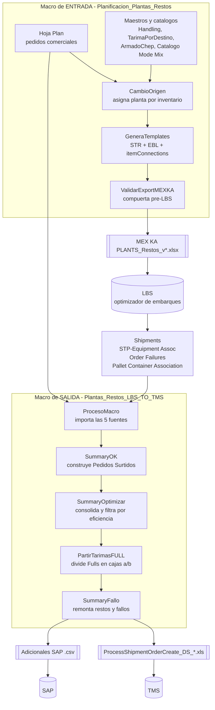

# Documentación de las macros LBS / TMS

Documentación funcional y técnica de las dos macros de Excel que forman el pipeline de
planeación y despacho: la **macro de entrada** que alimenta LBS, y la **macro de salida**
que convierte los resultados de LBS en la carga para TMS y SAP.

## Las dos macros

| | Macro de ENTRADA | Macro de SALIDA |
|---|---|---|
| Código | `merged/modulo1..7.vba` | `tms_fg14/modulo1..7.vba` |
| Libro anfitrión | `Planificacion_Plantas_Restos*.xlsm` | `Plantas_Restos_LBS_TO_TMS*.xlsm` |
| Qué recibe | Plan comercial, inventarios, catálogos maestros | Resultados de LBS + el mismo Plan |
| Qué entrega | `MEX KA PLANTS_Restos_v*.xlsx` (import a LBS) | `ProcessShipmentOrderCreate_DS_*.xls` (TMS) y CSV de Adicionales SAP |
| Documentación | [Macro Entrada/](Macro%20Entrada/README.md) | [Macro Salida/](Macro%20Salida/README.md) |

La macro de entrada decide **qué se puede pedir y desde qué planta**. LBS decide **cómo
agrupar eso en embarques**. La macro de salida decide **cómo se arman físicamente las
tarimas y los camiones**, y es la que contiene la mayor parte de las reglas por cadena.

## Flujo end-to-end

## Cómo navegar esta documentación

Cada macro tiene su carpeta, y dentro de cada una la documentación viene en **dos capas**:

- **Runbook de operador** (`01-runbook-operador.md`) — el orden de los botones, qué revisar
  después de cada paso y qué hacer cuando algo falla. Es lo que necesita quien corre la macro
  todos los días.
- **Referencia técnica** (los archivos numerados restantes) — mapas de columnas, constantes,
  procedimientos y algoritmos, con citas `archivo:línea` al código VBA.

Las reglas específicas de cada cliente viven en la subcarpeta `cadenas/` de cada macro,
con una página por cadena o familia de cadenas y una tabla comparativa en su `README.md`.

### Índice general

| Documento | Contenido |
|---|---|
| [glosario.md](glosario.md) | Terminología del negocio: folio, cartonaje, tarima, resto, charola, sándwich, cupo, armado, TI HI, mode mix, sencillo/full |
| [Macro Entrada/](Macro%20Entrada/README.md) | Macro de entrada: Plan, maestros, generación del export MEX KA, validaciones, sincronizaciones |
| [Macro Entrada/cadenas/](Macro%20Entrada/cadenas/README.md) | Reglas por cadena del lado de entrada (sufijos de item, destinos solo-Full, solo-sencillo) |
| [Macro Salida/](Macro%20Salida//README.md) | Macro de salida: importación de LBS, `Pedidos Surtidos`, motor de armado, eficiencia, exports |
| [Macro Salida/cadenas/](Macro%20Salida//cadenas/README.md) | Reglas por cadena del lado de salida (cupos, pisos de llenado, altura, peso) |

## Convenciones de esta documentación

- Los nombres de hojas, columnas, macros y constantes se citan **tal como están en el
  código**, sin traducir: `Pedidos Surtidos`, columna `AD`, `SummaryOK`,
  `LBS_WALMART_TRUCK_CAP`.
- Las afirmaciones técnicas llevan cita en formato `archivo:línea`, por ejemplo
  `tms_fg14/modulo2.vba:112`. Las líneas corresponden al estado del código al momento de
  escribir la documentación; si se reordena el VBA, las citas se desplazan pero los nombres
  de procedimiento siguen siendo el ancla confiable.
- Las tablas de constantes reproducen el comentario original del VBA de forma textual,
  porque ahí está registrada la justificación de negocio (acuerdos con cliente, fechas,
  referencias a `Max Pallet Count` del equipo).
- Esta documentación es puramente aditiva: no modifica ningún `.vba`.

## Fuera de alcance

No se documentan las carpetas históricas de respaldo (`latest/`, `v2/`, `working0406/`,
`tms_fg14/baseline/`, `tms_fg14/rollback/`, `merged copy/`) ni los scripts de auditoría de
`scripts/` de forma individual. Los scripts relevantes sí se referencian desde la sección
"Cómo validarlo" de cada página de cadena.
